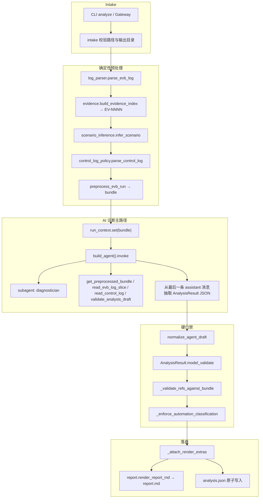

# Modem Log Analyzer —— 分析思路与处理架构

> 本文描述 **当前实现**（以仓库代码为准）如何分析一次 **NuttX 板端 Modem** 的单轮失败日志：设计思路、端到端流水线、关键决策规则与模块职责。  
> 面向：要读懂 / 改造本 Agent 的工程师。  
> 相关入口文档：[`README.md`](./README.md)、提示词真相源 [`PROMPT.md`](./PROMPT.md)、中断策略 [`INTERRUPTS.md`](./INTERRUPTS.md)。

---

## 0. 先说清楚：分析的是什么系统

**被分析的系统（板端）是 NuttX。**

| 概念 | 是什么 | 不是什么 |
| --- | --- | --- |
| **NuttX** | 板端运行的 RTOS；Modem / telephony / `modemcli` / 蜂窝数据等业务跑在这套系统上 | 不是本仓库里的 Python Agent |
| **EVB 日志 / merge.log** | 从 NuttX 设备侧采集、常按时间合并后的串口/模块日志（含 `modemcli>`、RPC、ping、SMS 等） | 不是自动化框架自己的 Python 日志 |
| **控制脚本日志** | PC/测试框架侧（如 `ims_device_event.py`）记录的下发命令与断言结果 | 不是 NuttX 内核日志 |
| **`EV-NNNN`** | **本分析器**在预处理时给「已解析的日志事件」编的内部证据号（如 `EV-0001`） | **不是** NuttX 协议字段、不是芯片寄存器、不是板端原生日志格式 |

因此：

- 输入侧：主要读 **NuttX EVB 上打出来的日志**；可选再读同一次测试的 **控制脚本日志** 来解释「为什么外部判 FAIL」。
- 输出侧：`analysis.json` / `report.md` 是 Atelier Agent 的诊断产物。
- 看到报告里的 `EV-0051`，应理解成：「请到本次分析索引里的第 51 条证据看原文」，再去对 NuttX 侧 `merge.log` 对应行——**不是 NuttX 自己定义的 ID**。

---

## 1. 一句话定位

把「已切分好的单次 **NuttX EVB** 日志」（可选再加同次控制脚本日志）变成：

1. 机器可读的 `analysis.json`（诊断事实的 **唯一结构化来源 / SSOT**）
2. 由确定性代码渲染的中文 `report.md`（给人读）

核心原则：**确定性预处理证据 → AI Agent 做归因草稿 → schema / 引用硬校验 → 确定性渲染落盘**。  
Agent **不**直接写报告文件；也 **不**在失败时静默退回规则管线冒充「AI 分析」。

---

## 2. 设计思路（为什么这样拆）

| 思路 | 含义 | 在代码里怎么体现 |
| --- | --- | --- |
| 证据先行 | 任何结论必须能指回日志原文 | 预处理生成稳定 `EV-NNNN`；草稿引用必须落在预处理集合内 |
| 外部分离 | 测试框架的 FAIL ≠ 板端产品故障 | `external_result` 与 `classification` 分开；报告里强调边界 |
| 诚实降级 | 证据不够就弱分类，不硬编故事 | 6 类枚举互斥；无控制侧直接证据不得用 `TEST_AUTOMATION_FAILURE_CONFIRMED` |
| 只读边界 | 分析器不是自动化执行器 | 工具仅 4 个只读 + validate；无 bash / write_file / git_* |
| 双轨后端 | 主路径 AI；规则管线仅降级/对照 | CLI 默认 `agent_runner`；`MODEM_LOG_ANALYZER_CLI_FORCE_RULES=1` 才走 `AnalysisService` |
| 确定性出报 | 同一 `AnalysisResult` 多次渲染应一致 | `report.render_report_md` / `atomic_write_artifacts` 不调 LLM |

分析要回答的业务问题（产品层）：

1. 这次脚本大概在测什么业务（Call / SMS / Data-Ping / Setting …）？
2. 板端最早在哪里偏离预期（`first_anomaly`）？
3. 异常如何沿因果链影响后续（`root_cause_chain`）？
4. 更像板端故障、环境、自动化断言问题，还是证据不足？
5. 还缺什么材料才能加强结论（控制日志 / 终态回调等）？

---

## 3. 端到端总览



**主路径调用链（CLI）：**

`cli._default_runner` → `agent_runner.run_agent_analyze` →（成功后）`report.atomic_write_artifacts`

**规则降级路径（仅显式 env）：**

`MODEM_LOG_ANALYZER_CLI_FORCE_RULES=1` 且允许环境 → `AnalysisService._run_rules_pipeline`  
生产环境误设 FORCE_RULES 且无 `ALLOW_RULES` / 非 dev|test → **直接拒绝**，防止静默伪装。

---

## 4. 阶段拆解：每一步在干什么

### 4.1 Intake（入口校验）

- 校验 EVB 路径可读、输出目录可写、覆盖策略（无 `--overwrite` 时禁止静默覆盖已有产物）。
- 不要求 loop/case 编号；缺省显示名为「单次测试执行」。
- `--dry-run`：仍做预处理，但 **不调 LLM、不写文件**，返回占位 `AnalysisResult`。

实现锚点：`cli.py`、`intake.py`。

### 4.2 EVB 日志解析（确定性）

`log_parser.parse_evb_log` 单遍扫描原始文本，产出事件流 `list[dict]`：

| 事件 kind（概念） | 含义 |
| --- | --- |
| `session_entry` | `modemcli>` 会话入口 |
| `command` | 业务命令（如 `debug_bes_rpc` / `!ping` / `!ifconfig`） |
| `callback` / `response` | 板端回调或响应行 |
| `warning` 等 | 其它可识别信号 |

同时尽量抽取：

- **双时间戳**：采集侧 ISO（merge.log 行首）+ 设备侧日期时间
- **模块名**：`ap` / `apc1` / `sensor` …
- **业务动作**：经 `command_catalog`（项目级 yaml）映射为 Call / SMS / Data-Ping / Setting / unknown
- **终态**：`terminal_outcome = success | failure | None`
- ANSI / 畸形 UTF-8 / 超长行：**fail-safe**，解析不崩

同一输入 → 同一事件序列（可回归）。

实现锚点：`log_parser.py`、`command_catalog.py`、`knowledge/modemcli_commands.yaml`（若存在）。

### 4.3 证据索引（`EV-NNNN`）——本分析器自编，不是 NuttX 概念

`evidence.build_evidence_index(events, source=文件名)`：

- 按事件顺序分配稳定 ID：`EV-0001`, `EV-0002`, …
- 每条含：`source`（展示用文件名，通常是 NuttX 侧 merge/EVB 日志名）、`line_no`、`raw_text`、`module`、`timestamp`
- **后续所有「正式引用」只能引用这些 ID**；Agent 不得发明 `EV-9999`

这是「可复核」的技术基础：报告里的 ``EV-xxxx`` 应对得上 `analysis.json` 里的 `evidence_refs[].raw_text`，再映射回 **NuttX EVB 日志原文行**。  
再次强调：`EV-` 前缀是 Atelier `modem-log-analyzer` 的索引约定，NuttX 源码/协议里没有这个命名。

### 4.4 场景推断（确定性启发式）

`scenario_inference.infer_scenario(events)` 根据命令序列猜测：

- 场景名（如 Data-Ping、语音通话、混合业务）
- `confidence`
- `business_actions` 列表

结果进入 preprocess **bundle**，也可在 Agent 漏填时由 `normalize_agent_draft` 回填。  
注意：这是启发式摘要，**不是**最终归因结论。

### 4.5 控制脚本日志（可选）

若提供 `--control-log`：

1. `parse_control_log` 逐行扫描，用正则识别「直接证据」：
   - `AssertionError` / `TimeoutError` / `case_result=FAIL` / traceback …
   - 以及真实脚本常见形态：`ERROR ... check ping ... fail`
2. 命中的行进入 `control_evidence` / `control_summary`
3. `has_control_evidence = has_direct_automation_evidence(...)`

**硬规矩：** 只有控制侧有直接证据时，才允许分类为 `TEST_AUTOMATION_FAILURE_CONFIRMED`  
（Agent 路径在 `_enforce_automation_classification` 再次强制；规则路径在 `decide_classification` 矩阵里体现）。

若 **板端未发现明显异常** 且 **未提供控制日志**，preprocess 会设置 `interrupt_request`（类型 `REQUEST_CONTROL_LOG`），提示可通过 LangGraph interrupt 补日志。详见 [`INTERRUPTS.md`](./INTERRUPTS.md)。

实现锚点：`control_log_policy.py`、`agent_runner.preprocess_evb_run`。

### 4.6 Preprocess Bundle（给 Agent 的工作台）

`preprocess_evb_run` 汇总为 bundle，写入 `run_context`，供工具读取。关键字段：

| 字段 | 用途 |
| --- | --- |
| `run_label` | 报告展示标识 |
| `command_summary` | 命令 + 对应 EV |
| `evidence_refs` / `evidence_index` | ID 列表 + 完整证据对象 |
| `scenario` / `business_actions` | 启发式场景 |
| `control_*` | 控制侧摘要与直接证据 |
| `interrupt_request` | 是否建议补控制日志 |

**故意不把绝对路径塞进给模型的 HumanMessage**（防 trace 泄露本机目录布局）；Agent 通过工具读 bundle / 切片。

### 4.7 AI Agent 诊断（主路径）

#### 角色

| 角色 | 职责 |
| --- | --- |
| 主代理 `Modem Log Analyzer` | 编排：读 bundle → 必要时委派 → 产出最终 JSON |
| 子代理 `diagnostician` | 单次合成诊断草稿（深度 ≤ 2，工具 ≤ 5，不互相调用） |

工具（主代理与 diagnostician 共用同一只读集合）：

1. `get_preprocessed_bundle` — 命令摘要 + EV 列表 + 控制摘要  
2. `read_evb_log_slice(start, end)` — 按行回读 EVB 原文窗口  
3. `read_control_log` — 仅当本 run 提供了控制日志  
4. `validate_analysis_draft` — 提交前 Pydantic schema 校验  

HumanMessage 要求最终回复 **只发一段 AnalysisResult JSON**（可 ```json 包裹）。

实现锚点：`agent.py`、`subagents.py`、`prompts.py`、`tools.py`、`agent_runner._compose_human_message`。

#### Agent「分析思路」（提示词约束下的期望推理）

1. 用 catalog 语义把命令序列还原成业务动作流（不要把 `modemcli>` 本身当业务）。  
2. 找最早板端异常（与规则侧 `find_first_anomaly` 概念对齐：ERROR/FAIL/TIMEOUT/No response 等，并过滤已知噪声如 RingPlayOnce）。  
3. 构造 Trigger → Propagation → Terminal Impact 式 `root_cause_chain`（每环挂真实 EV）。  
4. 在 6 类 `Classification` 中选一类；证据不足则 `DEVICE_EVIDENCE_INCOMPLETE` / `MULTIPLE_POSSIBLE_CAUSES`。  
5. 区分「外部 FAIL」与「板端是否真坏」；未确认自动化误报时不要越级。  
6. `validate_analysis_draft` 不通过则改草稿，禁止直接写文件。

> 实际质量取决于模型遵守程度。当前实现的硬保证主要在 **预处理 + 校验 + 渲染**；时间线是否充实、证据是否「说人话」仍高度依赖 Agent 草稿（已知痛点，见 §9）。

### 4.8 草稿规范化与硬校验

`run_agent_analyze` 在拿到 JSON 后：

1. **`normalize_agent_draft`**（确定性，不发明结论）  
   - 补 `schema_version` / `run_label` / 缺省 scenario  
   - 压平嵌套的 `first_anomaly`  
   - 用 preprocess index **补全** evidence 行号与 raw_text  
   - 从描述文本里捞合法 EV 填入根因链（仅限 preprocess 已有 ID）  
   - 缺省 `timeline=[]`、`external_result=FAIL`、`root_cause_confidence=low` 等  

2. **`AnalysisResult.model_validate`** — 公共契约字段形状  

3. **`_validate_refs_against_bundle`** — 草稿中所有 EV 必须 ∈ preprocess（防伪造）  

4. **`_enforce_automation_classification`** — 自动化误报分类必须有控制侧直接证据  

5. **`_attach_render_extras`** — 挂上 schema 外的 `control_evidence` / `business_actions` / `_meta`（供报告与调试）

失败时：**抛错**，不自动 fallback 到规则管线。

### 4.9 报告渲染（确定性）

`report.render_report_md(result)` 固定十章顺序（`REPORT_SECTIONS`）：

1. 失败概览  
2. 推断的测试场景与基线  
3. 核心诊断  
4. 根因链  
5. 失败时间线  
6. 测试步骤与日志证据  
7. 故障域判定与推理  
8. 剩余不确定性  
9. 建议行动  
10. 正式证据索引  

行为要点：

- 渲染前校验 `first_anomaly` / 根因链引用的 EV 存在于 `evidence_refs`  
- 「测试步骤与日志证据」只展示 **被引用到的关键 EV**（完整索引仍在 `analysis.json`）  
- 终端摘要会脱敏电话/长数字；本地 `report.md` 可为复核保留原文（见 [`PRIVACY.md`](./PRIVACY.md)）  
- `atomic_write_artifacts`：临时文件 + `os.replace`，双产物一起提交  

实现锚点：`report.py`、`contracts.py`。

---

## 5. 六类诊断分类（决策语义）

公共枚举见 `contracts.Classification`。规则管线用 `decide_classification` 的优先级矩阵；Agent 路径由模型选择，但受 `_enforce_automation_classification` 约束。

| 分类 | 含义（何时该用） |
| --- | --- |
| `DEVICE_FAILURE_CONFIRMED` | 板端业务异常明确且证据相对完整 |
| `ENVIRONMENT_FAILURE_INDICATED` | 环境/网络指征明确，板端未必是产品逻辑错 |
| `TEST_AUTOMATION_FAILURE_CONFIRMED` | **控制脚本有直接证据**，且不宜把板端判成产品故障 |
| `NO_DEVICE_ANOMALY_FOUND` | 板端看不到异常；**不等于**已证明自动化误报 |
| `DEVICE_EVIDENCE_INCOMPLETE` | 有异常迹象但缺终态/回调/关键行 |
| `MULTIPLE_POSSIBLE_CAUSES` | 多条候选根因无法收敛 |

规则矩阵（简化，权威以 `classification.decide_classification` 为准）：

```text
控制侧直接证据 且 无板端异常 且 无环境证据
  → TEST_AUTOMATION_FAILURE_CONFIRMED

板端异常 且 证据完整 且 无环境证据
  → DEVICE_FAILURE_CONFIRMED

仅环境指征
  → ENVIRONMENT_FAILURE_INDICATED

板端异常 且 证据不完整
  → DEVICE_EVIDENCE_INCOMPLETE

板端异常 且 环境异常并存
  → MULTIPLE_POSSIBLE_CAUSES

无异常 且 完整
  → NO_DEVICE_ANOMALY_FOUND

其它兜底
  → DEVICE_EVIDENCE_INCOMPLETE
```

首异常启发式：`find_first_anomaly`（关键字 + `terminal_outcome=failure`，并滤噪声）。  
置信度启发式：`compute_root_cause_confidence`（支撑引用数 / gap 数 / 分类）。

---

## 6. 规则管线（Legacy，非主路径）

`AnalysisService._run_rules_pipeline` 在无 LLM 时完成：

解析 → 证据 → 首异常 → 场景 → 分类 → 构造较模板化的 `AnalysisResult` → 同样走 renderer

用途：

- 离线单测 / 对照  
- 显式 `CLI_FORCE_RULES` 调试  

**不要**把它当成「当前产品主叙事」。CLI README / 运维文档若仍写「可不依赖 LLM 出完整归因」，指的是这条降级能力，而非默认 `analyze` 行为。

---

## 7. 数据结构心智模型

```text
AnalysisResult (SSOT)
├── classification / root_cause_confidence / external_result
├── scenario (+ business_actions 常挂在 extras)
├── first_anomaly { line_no, ref_id, summary, module?, ts? }
├── evidence_refs[]  ← 正式可复核原文
├── timeline[]       ← 失败时间线事件（依赖 Agent/规则是否填）
├── root_cause_chain[] { role, description, ref_ids, gap? }
├── control_log_used
├── notes[] / suggested_actions[]
└── (_meta / control_evidence / business_actions — 渲染扩展)
```

报告是 **视图**；改报告叙事应优先改「草稿约束 + 校验 + renderer」，而不是让模型直接写 Markdown。

---

## 8. 模块地图（按职责）

| 模块 | 职责 |
| --- | --- |
| `cli.py` | 入口、env、选择 Agent / 规则后端 |
| `intake.py` | 输入输出校验 |
| `agent_runner.py` | 预处理、invoke、规范化、引用门禁、主返回值 |
| `agent.py` / `subagents.py` / `prompts.py` | Deep Agent 装配与提示 |
| `tools.py` / `run_context.py` | 只读工具与 run 级上下文 |
| `log_parser.py` / `evidence.py` / `command_catalog.py` | 确定性解析与证据 |
| `scenario_inference.py` | 场景启发式 |
| `classification.py` | 规则侧分类 / 首异常 / 置信度 |
| `control_log_policy.py` | 控制日志解析与请求策略 |
| `analysis_service.py` | 规则管线降级 |
| `contracts.py` | 公共 schema |
| `report.py` | 确定性 Markdown / JSON / 原子写盘 |
| `checkpointer.py` / `llm.py` / `tracing.py` | 持久化、模型、LangSmith |

测试分布：`tests/unit/`（解析、契约、renderer、runner、工具）、`tests/integration/`、真实样本 `tests/fixtures/e2e_real_samples/`。

---

## 9. 当前行为边界与已知局限

**已保证的：**

- 预处理确定性与 EV 稳定性  
- 伪造 EV 被拒  
- 无控制侧直接证据时不能落盘 `TEST_AUTOMATION_FAILURE_CONFIRMED`  
- 报告章节顺序固定、双产物原子写入  
- Agent 失败不静默冒充规则成功  

**高度依赖 Agent 草稿、因而容易「看起来填满但不好用」的：**

- `timeline` 常被填空 → 报告出现「无关键业务事件」  
- `evidence_refs` 可能选到空 `modemcli>` 行，或与 `first_anomaly` 行号/ID 不一致（规范化能修一部分形状，不能代替选对证据）  
- 长 `scenario` 被概览 / 场景节重复粘贴，领口不够「结论先行」  
- `suggested_actions` 可空  

产品侧改进方向（Timeline Spine 等）见：  
`docs/plans/2026-07-21-002-feat-modem-report-timeline-spine-plan.md`（仓库根下）。

---

## 10. 一次真实分析的「逻辑剧本」（对照理解）

以 `auto_case_modem_52_loop75` 类样本为例（概念剧本，非保证当前输出质量）：

1. **预处理**识别：查 data 通道 → `!ifconfig` → `!ping` → SMS；给每行稳定 EV。  
2. **控制日志**若存在：命中 `check ping ... fail` → 具备自动化直接证据候选。  
3. **Agent**应指出：首包 ICMP 超时等板端现象；后续多数 ping 恢复；SMS 可能成功；外部 FAIL 来自控制侧断言窗口。  
4. **分类**在「板端偶发超时」与「断言过严 / 自动化」之间权衡；若要用 `TEST_AUTOMATION_FAILURE_CONFIRMED`，必须满足控制侧直接证据门禁。  
5. **渲染**把结构化字段铺进十章；读者应能从 EV 回到 merge.log 原文。

若输出时间线为空、证据对不齐，问题通常出在 **第 3 步草稿质量**，而不是第 1 步预处理失败。

---

## 11. 相关文档索引

| 文档 | 内容 |
| --- | --- |
| [`README.md`](./README.md) | 安装、CLI、分类速查 |
| [`PROMPT.md`](./PROMPT.md) | 系统提示真相源与变更记录 |
| [`INTERRUPTS.md`](./INTERRUPTS.md) | 控制日志 interrupt / resume |
| [`COMMAND_CATALOG.md`](./COMMAND_CATALOG.md) | ModemCLI 命令语义 |
| [`OPERATIONS.md`](./OPERATIONS.md) | 运维与故障码 |
| [`TESTING.md`](./TESTING.md) | 测试策略 |
| [`PRIVACY.md`](./PRIVACY.md) | 脱敏与敏感字段 |
| [`MCP_AND_SKILLS.md`](./MCP_AND_SKILLS.md) | 项目级 MCP/Skills 边界 |
| [`../AGENTS.md`](../AGENTS.md) | 本 Agent 宪法（只读、禁跨 Agent import 等） |

---

## 12. 变更说明

| 日期 | 说明 |
| --- | --- |
| 2026-07-21 | 初版：根据当前 `agent_runner` / parser / classification / report / CLI 实现整理中文架构与分析思路 |
| 2026-07-21 | 增补 §0：明确分析对象是 **NuttX 板端**；澄清 `EV-NNNN` 为本分析器证据号、非 NuttX 协议字段 |
