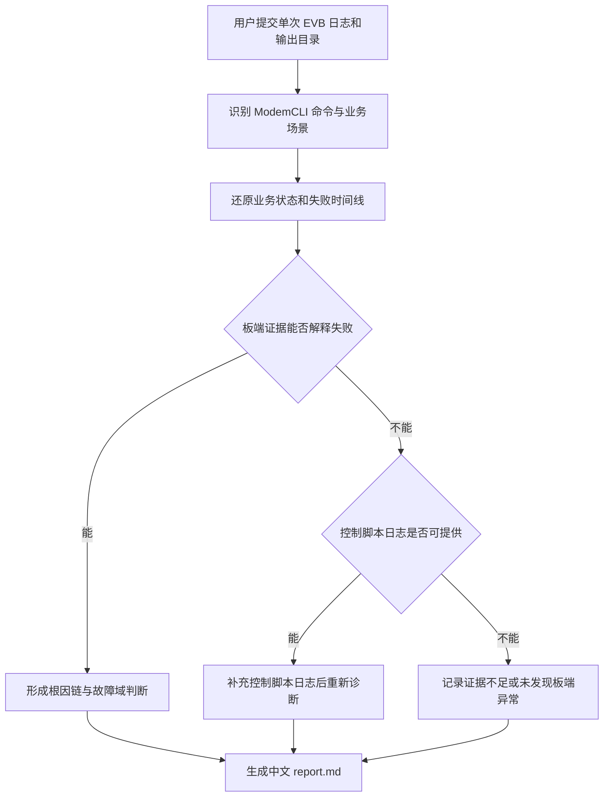

# NuttX Modem 单轮失败日志分析 Agent

## Problem Frame

嵌入式测试工程师需要分析运行在 NuttX EVB 板上的 Modem 自动化测试失败。业务主要包括通话、短信、数据连接、IPv4/IPv6 Ping，以及飞行模式、VoLTE、IMS 等状态开关。现有分析依赖工程师从高噪声、多模块、异步交错的板端日志中手工识别命令、还原业务状态并定位异常，耗时且结论难以复核。

新 Agent 应面向一个已经由测试流程判定为失败、且已切分到单次执行的 case。它以 EVB 板端日志为必需输入，利用项目提供的 ModemCLI 命令说明理解测试动作，通过专用命令行工具在用户指定的输出目录生成中文 Markdown 失败分析报告。控制脚本日志是按需补充材料，不是初始必需输入；loop 或 case 标识可以自动提取或由用户选填，但不得作为分析的必需参数。

Agent 的目标不是重复宣布 case 为 FAIL，而是回答：板端最早在哪里偏离预期、异常如何影响后续业务、证据支持哪类故障归因，以及还缺少什么材料才能增强结论。

## Requirements

**输入与场景识别**

- R1. 每次分析必须面向一个已经切分好的单次执行 EVB 日志；Agent 不负责从整批压力测试日志中自动选择或切分轮次，也不得强制用户另行提供 loop 编号。
- R2. EVB 板端日志和报告输出目录是必需输入；控制脚本日志、case 名称、自定义标识和一句话测试目标均为可选输入。loop 或 case 标识应尽量从日志或文件名自动提取，无法提取时不得阻塞分析。
- R3. Agent 必须使用项目级 ModemCLI 命令说明作为领域知识，将 `modemcli` 识别为进入控制 CLI 的入口，将随后执行的 `debug_bes_rpc`、`!ping`、`!ping6`、`!ifconfig` 等识别为实际操作；不得把 `modemcli` 本身当作业务步骤。
- R4. 在用户没有提供 case 描述时，Agent 必须根据命令序列和板端事件推断测试场景与验收条件。高置信度时直接诊断；中置信度时继续诊断并显式列出假设；低置信度且不同测试目标会改变结论时，应先请求用户确认。
- R5. 第一版必须覆盖四类业务：Call，SMS，Data/Ping，以及 Setting 状态开关；混合场景应能组合这些业务，例如通话期间发送短信或维持 Ping。

**日志理解与证据**

- R6. Agent 必须清理不承载业务含义的日志噪声，包括终端 ANSI 控制字符，并区分命令回显、RPC 调用、异步回调、状态通知和最终结果。
- R7. Agent 必须考虑 NuttX 板端日志可能包含多个模块或核、异步事件交错、采集时间与设备时间并存等特征；不得仅因文件行顺序相邻就断言事件存在因果关系。
- R8. Agent 必须围绕业务状态转换还原本次测试执行，而不是只搜索错误关键词。至少应理解通话、短信、数据/Ping 和状态开关各自的主要动作与状态变化。
- R9. 每个关键事实、异常点和根因结论必须能够回指本次测试执行中的原始日志证据，证据至少包含来源文件、可定位位置、时间戳（如存在）和原始日志文本。
- R10. Agent 必须区分日志事实、基于领域知识的推断和仍未证实的假设；领域背景或命令说明不得替代板端日志成为故障事实证据。
- R11. 默认不做跨 loop 全量统计或聚类。只有用户额外提供对照日志且对解释目标 loop 有帮助时，才可选择至多一个最相近的正常 loop 作为对照；没有正常 loop 时不得强行建立跨轮基线。

**诊断与证据边界**

- R12. Agent 必须识别本次测试执行中最早可观察的异常步骤，并在证据允许时形成 `Trigger → Propagation → Terminal Impact` 根因链；若链条存在缺口，应明确标记，不得补造事件。
- R13. 顶层诊断分类必须使用以下之一：`DEVICE_FAILURE_CONFIRMED`、`ENVIRONMENT_FAILURE_INDICATED`、`TEST_AUTOMATION_FAILURE_CONFIRMED`、`NO_DEVICE_ANOMALY_FOUND`、`DEVICE_EVIDENCE_INCOMPLETE` 或 `MULTIPLE_POSSIBLE_CAUSES`。`TEST_AUTOMATION_FAILURE_CONFIRMED` 只能在控制脚本日志提供直接证据时使用。
- R14. 仅有 EVB 日志时，`NO_DEVICE_ANOMALY_FOUND` 只表示板端证据不支持产品故障，不等于已确认自动化脚本误报，也不得断言具体的脚本、断言或超时缺陷。
- R15. 当 EVB 日志无法解释外部 case 的 FAIL，且控制脚本日志可能改变归因时，Agent 必须主动请求同一次执行的控制脚本日志。用户无法提供时，仍应生成报告，并清楚记录证据边界和需要人工检查的板外环节。
- R16. 用户补充控制脚本日志后，Agent 必须重新评估诊断。只有控制日志提供了直接证据时，报告才能将故障明确归因于自动化命令执行、断言或超时；否则保持较弱结论。
- R17. 所有诊断都必须给出根因置信度及简短依据。证据不足时使用不确定结论，不得把“没有看到错误”当成板端业务成功。

**Markdown 报告**

- R18. 交付物必须提供专用 CLI 作为主要用户入口。CLI 接受单次 EVB 日志和输出目录，支持可选控制脚本日志与自定义标识，并在成功完成时生成中文 `report.md` 和机器可读的 `analysis.json`；终端仅输出简洁诊断摘要和产物位置。
- R19. `report.md` 默认采用以下精简章节顺序：`失败概览`、`推断的测试场景与基线`、`核心诊断`、`根因链`、`失败时间线`、`测试步骤与日志证据`、`故障域判定与推理`、`剩余不确定性`、`建议行动`、`正式证据索引`。
- R20. `失败概览` 必须包含输入材料、可用的 loop/case 标识、推断场景、场景置信度、诊断分类和根因置信度；外部测试结果应保留为 `FAIL`，但不得与 Agent 的故障归因混为一个字段。没有标识时以“单次测试执行”表述，不得阻塞报告生成。
- R21. `推断的测试场景与基线` 必须展示识别到的业务动作、推断出的执行步骤、预期状态或验收条件，以及这些内容是用户提供还是 Agent 推断。
- R22. `核心诊断` 必须结论先行，说明首个异常步骤、最可能原因、直接影响和结论边界；若未发现板端异常，也必须明确说明已验证到的关键状态和缺失证据。
- R23. `失败时间线` 和 `测试步骤与日志证据` 必须使工程师能够看到实际执行了什么、观察到什么、预期与实际如何不同，以及异常后哪些步骤被影响或缺少观察。
- R24. `剩余不确定性` 必须集中列出缺失日志、无法确认的端到端结果、低置信度场景推断和板外证据缺口；`建议行动` 必须给出能够缩小这些不确定性的具体下一步。
- R25. `正式证据索引` 必须集中列出报告使用的关键原始日志证据，正文结论应能够清晰对应到这些证据，但报告不得制造不存在的文件、行号或时间戳。

## Success Criteria

- 用户能够只提供单次 EVB 日志和输出目录完成一次 CLI 分析，无需另行填写 loop 编号或逐条测试步骤，并获得 `report.md` 与 `analysis.json`。
- 对包含已知 ModemCLI 命令的单次日志，报告能正确还原主要业务动作及其执行顺序。
- 对四类首期业务各准备的代表性失败样例，报告能指出最早的板端异常或诚实给出证据不足，并附可复核的原始日志证据。
- 在由嵌入式测试工程师标注的首期样例集上，顶层诊断分类、首个异常步骤和关键证据选择可与人工标注逐项对照；不一致项必须可追踪，不能只依赖报告文字是否“看起来合理”。
- 当板端状态流看似正常但无法解释外部 FAIL 时，Agent 不误判为产品成功或确定的自动化缺陷，而是按需请求控制脚本日志。
- 同一输入重复分析时，顶层诊断分类、首个异常步骤和核心证据保持稳定，不因措辞变化而改变实质结论。
- 工程师无需逐条描述测试步骤；仅凭单轮 EVB 日志和命令说明，Agent 能在置信度足够时自动推断场景并生成完整报告。
- 报告中的每个关键结论均能由正式证据索引验证；证据缺失时报告明确降级置信度。

## Scope Boundaries

- 第一版不分析整批压力测试，不自动切分 loop，不选择“最值得分析”的轮次，也不生成跨轮失败率或聚类统计。
- 第一版不要求存在成功 loop，不强制做正常/失败对比；可选对照最多使用一个与目标 loop 最相近的正常 loop。
- 第一版不读取或分析自动化测试源码。
- 第一版不从 EVB 日志单独推断具体的控制脚本缺陷。
- 第一版不自动执行设备命令、复现测试、修改设备状态或控制 EVB。
- 第一版不把未知 Modem 芯片或协议栈实现细节假定为事实；相关知识需要由项目级材料或日志证据支持。
- 第一版不以通用批处理 workflow 的 12 节完整报告、外部 Web 调研、批量索引或循环统计为交付目标。

## Key Decisions

- 采用确定性日志整理与 Agent 语义诊断相结合的方向：保证证据可定位，同时保留对未知日志模式的解释能力。
- 以专用 CLI 作为首要交付入口，并同时输出 `report.md` 与 `analysis.json`：兼顾工程师本地使用和未来 gateway/API 集成。
- 每次只分析已切分好的单次执行日志，loop/case 标识自动提取或选填：避免第一版承担批处理、轮次选择和跨轮统计的额外复杂度，也避免重复输入。
- EVB 日志必需、控制脚本日志按需补充：保持最低输入成本，并在板端证据无法解释 FAIL 时允许增强诊断。
- 命令说明表承担领域词典作用：用户无需重复描述每一步，但 Agent 必须标明自动推断的场景和验收条件。
- 将外部 `FAIL` 与板端故障归因分离：防止把测试框架结果直接等同于产品故障。
- 使用精简中文 Markdown 报告：保留根因链、时间线和正式证据，同时移除批量 workflow 中与单轮诊断无关的统计和研究章节。

## Dependencies / Assumptions

- 项目会提供并维护 ModemCLI 命令说明，且该知识来源遵守仓库要求，只存在于新 Agent 的项目级目录或明确声明的项目来源中。
- 输入 EVB 日志属于一次明确的测试执行；日志或文件名可能包含 loop/case 标识，但缺少标识不影响分析。
- 日志可能不足以证明短信端到端送达、通话对端体验或网络外部可达性；报告必须按可观察边界表述结论。
- 具体 Modem 芯片、协议栈和成功/失败日志标记尚未完全盘点，需要在规划阶段结合更多样例确认。

## Outstanding Questions

### Resolve Before Planning

- 无。

### Deferred to Planning

- [Affects R5, R8][Needs research] 四类业务各自应采用哪些最小状态模型和可验证成功/失败标记？
- [Affects R9, R25][Technical] 对经过清洗和切片的日志，如何生成稳定、可复核且不伪造的证据定位标识？
- [Affects R4, R17][Technical] 场景置信度、根因置信度以及主动索取控制日志的阈值如何定义和评测？
- [Affects R16][Needs research] 控制脚本日志的常见格式和能够支持自动化归因的直接证据有哪些？
- [Affects success criteria][Needs research] 首期评测集应从哪些 Call、SMS、Data/Ping、Setting 样例构成，并如何标注期望根因与证据？

## Next Steps

-> `/ce:plan` for structured implementation planning
