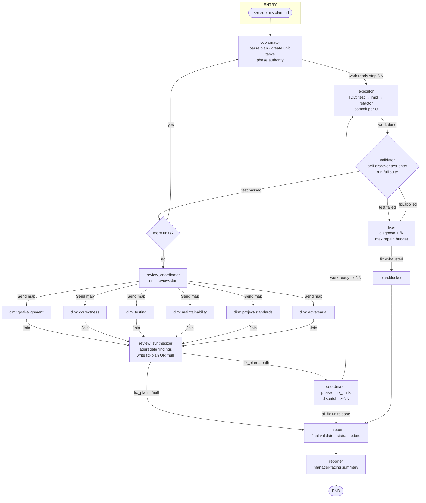
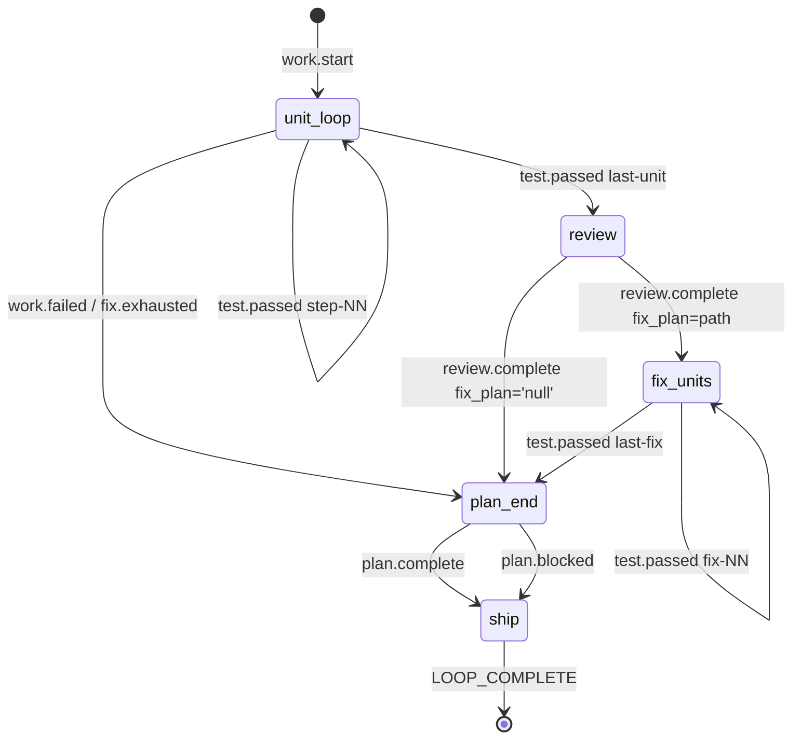

## Summary

新增一个名为 `compound-builder` 的 Atelier Agent,把 ralph ce-executor-serial workflow 搬进 LangGraph StateGraph:接收 `plan.md`,沿 coordinator → executor → validator → 失败 fix 环 → 6 维度并行评审 → review-synthesizer → fix-units → shipper → reporter 链路把 plan 跑完,逐 U 落 commit,**永不 push**。Agent 通过 `gateway/api` 注册并对外暴露。

## Problem Frame

Atelier 目前唯一对外暴露的 Agent 是 `code-writer`(Deep Agents 大厨模式),适合短而开放的任务。但 ralph 那一套"plan-driven + TDD + 评审流水线 + 多阶段 fail-stop"的工作流,**用 Deep Agents 模式承载不稳**:LLM 可能跳过强制阶段,sub-agent 数量也撞上限。

我们需要第二种 Agent 形态 — **LangGraph StateGraph 流水线形态** — 来承载长、强结构、可并发的工作流。第一条业务场景就是复刻 ralph ce-executor-serial,代号 `compound-builder`。它也给后续"任何带强制阶段 + 评审 + 修复环路的工作流"立模板。

## High-Level Technical Design

### 拓扑图(完整 10 节点 + 6 维并行)

### 阶段权威(phase_authority)状态机

`CompoundBuilderState` 上的 `phase` 字段是 SSOT,Coordinator 节点根据 `phase` 决定可发的事件(替代 ralph 的事件总线白名单)。

### StateGraph 装配策略

- 节点 = 函数(node fn),签名 `(state: CompoundBuilderState) -> dict`
- 边 = 普通边 + 条件边(`unit_loop → review` 仅在 `units 全部 closed`)
- 6 维并行 = `review_coordinator` 节点返回 `Send([...])` 列表,`add_node("dimension_reviewer", ..., destinations=[...])` 走 fan-out → `add_node("review_synthesizer", ...)` 走 Join
- `Command(goto=...)` 用于跨阶段跳转(从 `ship` 阶段单步跳到 END)
- Checkpointer 通过 `compile(checkpointer=...)` 挂上

## Requirements

### 编排形态

- R1. Agent 以 LangGraph StateGraph 形式实现,节点数 ≥ 10(coordinator / executor / validator / fixer / review_coordinator / 6 维度 reviewer / review_synthesizer / shipper / reporter / progress_steward)。
- R2. 6 维度 review 通过 `Send(map)` 并行启动,通过 Join 同步收口。
- R3. `phase_authority` 是 StateGraph 内置 SSOT — coordinator 节点根据 state.phase 选择可发事件。
- R4. `repair_budget = 3`(可调);超出 → coordinator 升级 `plan.blocked`。

### Plan 解析与契约

- R5. Coordinator 接收 plan.md 路径,解析为 `PlanSchema`(Pydantic),包含 `units: list[Unit]`、`acceptance`、`scope_boundaries`。
- R6. 单元(U-ID)字段:`title / files / approach / test_scenarios / verification / status / task_id / attempt_count / last_error`。
- R7. `parse_plan` 工具用强校验;失败必须 `plan.blocked(reason=plan_*)`。

### 工具与 HITL

- R8. `tools.py` 暴露:bash / write_file / edit_file / read_file / glob / grep / git_commit / git_diff / discover_test_entry / run_tests / parse_plan / validate_plan / write_findings_json / emit_state_event。
- R9. `git_push` / `git_push_tool` / `git_worktree add` / `git_checkout -b` **永不注册**(继承 code-writer 硬约束;smoke.sh 镜像检查)。
- R10. `interrupt_on` 默认覆盖 `bash / write_file / edit_file / git_commit`(`ATELIER_INTERRUPT_DEFAULT=true` 切换)。
- R11. Validator 用 `discover_test_entry` 探针:`pytest` / `make test` / `cargo test` / `npm test` / `go test ./...` 优先级链;落不到回 `test.failed(reason=no_test_entry)`。

### State + 持久化 + 追踪

- R12. `state.py` 定义 `CompoundBuilderState(TypedDict)`,包含 plan / units / current_unit_index / workdir / phase / review_findings / fix_plan_path / review_round / repair_budget_used / decisions / messages。
- R13. Checkpointer:本地 `MemorySaver` 默认;`ATELIER_CHECKPOINTER_URL` 设置时切到 `PostgresSaver`(硬约束 4)。
- R14. tracing 走 LangSmith;`init_tracing(project="atelier-compound-builder")`。

### Gateway 集成

- R15. `gateway/api/registry.py` AGENT_REGISTRY 增加 `compound-builder` 条目。
- R16. `gateway/api/routers/compound_builder.py` 提供 `/threads`、`/runs`、`/state`、`/history`(参照 `code_writer.py`)。
- R17. `gateway/api/routers/__init__.py` `ALL_ROUTERS` 追加 `compound_builder_router`。
- R18. Plan worktree 由 gateway 创建,Compound Builder **不调** `git worktree add`(沿用 ralph HARD RULE)。

### 模板适配

- R19. 从 cookiecutter `_templates/agent-template/` 起骨架,然后改造 `agent.py` 走 StateGraph(脱离 `create_deep_agent`)。
- R20. `langgraph.json` graphs 段:`{compound_builder: ./src/compound_builder/agent.py:graph}`。
- R21. 顶层 `tests/test_atelier_layout.py` 新增 1 个测试,确认 Compound Builder 文件齐备且无 push 工具注册。

### 文档

- R22. `docs/PROMPT.md` 写入提示词初始版本(后续每次 prompt 改动都同步追加变更记录 — 硬约束 3)。
- R23. `docs/INTERRUPTS.md` 列出所有 `interrupt_on=True` 的工具及恢复语义。
- R24. `docs/MCP_AND_SKILLS.md` 显式写"项目级",禁用全局 `~/.claude/skills` 引用(硬约束 8)。
- R25. `docs/README.md` 用 Ankane 风格:Description / Installation / Usage / Configuration / State / Operations。

### 测试

- R26. `tests/unit/`:plan 解析器、phase_authority 转换、repair_budget 计数、tools 注册校验(无 push 工具)。
- R27. `tests/integration/`:stub LLM 跑整图覆盖 happy-path / validator-fail / fix-exhausted / review-pass-with-fix / review-pass-without-fix / push-forbidden / interrupt-resume。
- R28. `tests/eval/`:LangSmith dataset — 至少 4 类 plan fixture(TDD / characterization / refactor / trivial)。

## Key Technical Decisions

- KTD-1. **StateGraph over Deep Agents**:此 Agent 与 ralph workflow 1:1 对齐,需要强制阶段 + 并行 fan-out,Deep Agents 大厨模式承载不稳 — 改用 LangGraph 原生 StateGraph 装配。
- KTD-2. **6 维度并行而非串行**:用户已选;通过 `Send(map)` fan-out + Join 同步实现,与 ralph 源串行不同,但对长链路加速明显。
- KTD-3. **phase_authority 在 StateGraph 内**:替代 ralph 的事件总线白名单;实现为 state 字段 + 条件边;不引入额外服务。
- KTD-4. **worktree 由 gateway 创建**:Compound Builder 不调 `git worktree add`;与 ralph HARD RULE 一致,降低 agent 越权风险。
- KTD-5. **Validator 自发现测试入口**:不强制 `make test`,优先 `pytest / cargo test / npm test / go test ./...`,与 ralph 行为对齐。
- KTD-6. **不引入持久化事件总线**:StateGraph state 充当 SSOT;不引入 Redis / 消息队列,留在单进程内。
- KTD-7. **模板改写而非扩展**:`agent.py` 不再走 `create_deep_agent`;保留模板其他部分(subagents.py / cli.py / skills_loader.py / mcp_servers.py 结构)以便未来 Agent 复用。

## Scope Boundaries

### In scope

- `agents/compound-builder/` 完整包(脚手架 + 自定义 StateGraph 装配)
- `gateway/api/registry.py`、`routers/compound_builder.py`、`routers/__init__.py` 接入
- 6 维度并行评审节点 + review_synthesizer 聚合逻辑
- 测试入口自发现工具
- interrupt 配置 + push-tool lint
- 4 类 plan fixture 的 LangSmith dataset
- 顶层 smoke / 结构测试条目扩展

### Deferred to Follow-Up Work

- **plan amendment 协议**:ralph 提供"coordinator 自行合并/拆分/重排 Units"的能力;本版本先用原始 plan.md 顺序,留给后续 PR。
- **multi-plan 并发**:`compound-builder` 当前单 plan;后续可接 gateway 调度层做并发。
- **sub-Graph per hat**:`dimension_reviewer` 在本版是单节点函数(参数化 dimension),不拆 sub-graph。
- **waves 并行**(`-H ce-executor-parallel`):本版本只复刻 serial,但已经为后续 parallel preset 留好接口(`mechanism.flow.kind` 字段)。
- **外部 trace 自发现**:`discover_test_entry` 暂只覆盖常见栈;`bun / deno / pnpm-workspace` 等小众环境延后。

### Outside this product's identity

- **替代 ralph**:本 Agent 是 Atelier 平台上的一个实现,不取代 ralph CLI;两套并存。
- **跨 Agent 协调**:compound-builder 与 code-writer 的交互,**永远**走 gateway HTTP,不直接 `from agents.* import`。
- **自动 push**:与 code-writer 同款,任何 push 类工具不注册。

## System-Wide Impact

- **新增 Agent 入口**:`gateway/api/main.py` `/agents` 列表自动出现 `compound-builder`。
- **LangGraph Studio 路由**:`langgraph dev` 在 `agents/compound-builder/` 目录下启动新 Studio 实例;不影响 code-writer。
- **CI 流水线**:顶层 `make smoke` 增加 compound-builder 检查条目;`pytest tests/` 新增 `test_compound_builder_layout.py`。
- **并发限制**:Send(map) 6 维并发对 LLM 调用量翻 6 倍 — 评测阶段需监控 rate-limit;通过 `ATELIER_REVIEW_PARALLELISM` env 控制(默认 6)。

## Risks & Dependencies

- **Risk: Send(map) 维度撞 rate-limit**。Mitigation:通过 `ATELIER_REVIEW_PARALLELISM` 控制并发度;评测阶段监控 LangSmith token。
- **Risk: 模板 agent.py 改写偏离 cookiecutter 进化路径**。Mitigation:不在 cookiecutter 模板里强制 — Compound Builder 是"用模板但不走模板装配"的第一例,后续 Agent 模板再考虑 StateGraph 选项。
- **Dependency: langgraph ≥ 0.2**(Send API 稳定版);若版本回退需 fallback 到 `add_node` + 自写 join。
- **Dependency: Atelier gateway 路由模板稳定**;Compound Builder router 模仿 code-writer 形态。
- **Risk: 6 维度 reviewer prompt 长度**,可能撞主 LLM context window。Mitigation:每个 reviewer 只接 `diff_base + changed_files + dimension focus`,不接完整 repo。

## Sources & Research

- `agents/code-writer/src/code_writer/agent.py:55-64` — Deep Agents `create_deep_agent` 装配参考;Compound Builder **不**用这一行。
- `gateway/api/registry.py:25-35` — AGENT_REGISTRY schema;compound-builder 按相同 key shape 添加。
- `gateway/api/routers/__init__.py:8-11` — ALL_ROUTERS 追加形态。
- `scripts/smoke.sh:84-99` — tools.py 不注册 `git_push` 的反向断言;Compound Builder 镜像校验。
- `tests/test_atelier_layout.py:37-44` — code-writer 无 push 工具测试样例;Compound Builder 沿用同款。
- `AGENTS.md:1-20` — Atelier 硬约束 8 条全继承。
- `agents/code-writer/langgraph.json` — `langgraph.json` 结构;Compound Builder 改 graphs key 为 `compound_builder`。
- `agents/code-writer/pyproject.toml` — 依赖模板;Compound Builder 加 `langgraph >= 0.2` 已够。

## Open Questions

- 无 — 用户在 brainstorming 阶段已敲定所有关键决策。

## Implementation Units

### U1. Cookiecutter 脚手架 + 包结构初始化

- **Goal**:用 `_templates/agent-template/` 生成 `agents/compound-builder/` 骨架,跑通 `uv sync` 与 `pytest -q` 基线。
- **Requirements**:R19
- **Dependencies**:—
- **Files**: `agents/compound-builder/pyproject.toml`、`agents/compound-builder/AGENTS.md`、`agents/compound-builder/.env.example`、`agents/compound-builder/Makefile`、`agents/compound-builder/Dockerfile`、`agents/compound-builder/langgraph.json`、`agents/compound-builder/skills/{code-review-mindset,conventional-commit}/SKILL.md`、`agents/compound-builder/src/compound_builder/__init__.py`、`agents/compound-builder/src/compound_builder/{prompts,tools,subagents,interrupts,checkpointer,llm,tracing,mcp_servers,skills_loader,cli,state}.py`、`agents/compound-builder/tests/{unit,integration,conftest}.py`、`agents/compound-builder/tests/unit/test_prompts.py`、`agents/compound-builder/docs/{README,PROMPT,INTERRUPTS,MCP_AND_SKILLS}.md`
- **Approach**:`cookiecutter _templates/agent-template/` 起包;`uv sync` 解决依赖;`make smoke` 通过。
- **Test scenarios**:
  - happy-path: cookiecutter 生成目录齐备,`make test` 在空状态下返回 0(模板默认测试可空跑)
  - edge-case: 包内不引用 `agents.code_writer.*`(防跨 Agent import — 硬约束 1)
- **Verification**:`cd agents/compound-builder && make smoke && make test` 全绿。

### U2. StateGraph 顶层装配 + 阶段权威 + 6 维并行

- **Goal**:用 LangGraph 原生 API 拼出完整 StateGraph(10 个节点 + 6 维 Send 并行 + Join + 条件边),`phase_authority` 由 state.phase + 条件边驱动。
- **Requirements**:R1, R2, R3, R4, R12
- **Dependencies**:U1
- **Files**: `agents/compound-builder/src/compound_builder/agent.py`、`agents/compound-builder/src/compound_builder/state.py`、`agents/compound-builder/src/compound_builder/graph.py`、`agents/compound-builder/src/compound_builder/nodes/coordinator.py`、`agents/compound-builder/src/compound_builder/nodes/executor.py`、`agents/compound-builder/src/compound_builder/nodes/validator.py`、`agents/compound-builder/src/compound_builder/nodes/fixer.py`、`agents/compound-builder/src/compound_builder/nodes/review_coordinator.py`、`agents/compound-builder/src/compound_builder/nodes/dimension_reviewer.py`、`agents/compound-builder/src/compound_builder/nodes/review_synthesizer.py`、`agents/compound-builder/src/compound_builder/nodes/shipper.py`、`agents/compound-builder/src/compound_builder/nodes/reporter.py`、`agents/compound-builder/src/compound_builder/nodes/progress_steward.py`
- **Approach**:
  - `state.py` 定义 `CompoundBuilderState` TypedDict(含 phase 字段)
  - `graph.py` 用 `StateGraph(CompoundBuilderState)` 装配节点 / 边 / 条件 / Send
  - `nodes/*.py` 每个文件一个节点函数,签名 `(state) -> dict`(只 return delta,框架 merge)
  - 阶段跳转:`add_conditional_edges("coordinator", route_by_phase, {...})`
  - 6 维并行:`review_coordinator` 节点返回 `[Send("dimension_reviewer", {"dimension": d}) for d in DIMENSIONS]`;Join 节点收口后路由到 `review_synthesizer`
  - 终态 `Command(goto=END, update={"phase": "terminal"})`
- **Test scenarios**:
  - happy-path:整图 `graph.compile()` 成功;stub LLM 下跑 1 个 trivial unit → END
  - edge-case:`repair_budget_used == 3` 时,validator 失败应走 `plan.blocked` 边
  - edge-case:`units` 全部 closed 后,`test.passed` 触发 `unit_loop → review` 跳转(而非回到 unit_loop)
  - integration:6 维 reviewer 同时收到 Send,Join 节点在 6 个 review.dimension.done 后才 forward
- **Verification**:`pytest agents/compound-builder/tests/integration/test_state_flow.py` 全绿;`langgraph dev` 启动后 Studio 可见完整图。

### U3. tools.py(完整 Git/文件/测试自发现/plan 校验)

- **Goal**:实现 `tools.py` 中所有 R8 列出的工具,严格遵守 R9 无 push 工具约束。
- **Requirements**:R8, R9, R11
- **Dependencies**:U1
- **Files**: `agents/compound-builder/src/compound_builder/tools.py`、`agents/compound-builder/tests/unit/test_tools.py`
- **Approach**:
  - 工具用 `@tool` 装饰器(`langchain_core.tools`)
  - `build_tools()` 返回 list;`smoke.sh` 镜像校验:在 `tools.py` 中 grep `git_push_tool|name *= *"?git_push"?|def +git_push\b` 必须 0 命中
  - `discover_test_entry` 优先级:`pytest`(有 `pyproject.toml` 含 `[tool.pytest]`) → `make test`(有 `Makefile` 且含 `test:` target) → `cargo test`(有 `Cargo.toml`) → `npm test`(有 `package.json`) → `go test ./...`(有 `go.mod`) → 抛 `NoTestEntryError`
  - `parse_plan` 走 `pydantic.BaseModel`;失败抛 `PlanValidationError`
- **Test scenarios**:
  - happy-path:fixture 仓库(给个示例 plan.md)→ `parse_plan` 返回正确 units 数量
  - edge-case:`discover_test_entry` 在无 `pyproject.toml` 也无 `Makefile` 的目录应抛 `NoTestEntryError`
  - 错误路径:tools.py 不导出 `git_push` / `git_push_tool`;测试用 `dir(build_tools())` 反向断言
- **Verification**:`pytest tests/unit/test_tools.py` 全绿;`bash scripts/smoke.sh` 在 smoke 段 4 通过。

### U4. prompts.py + interrupt 配置

- **Goal**:为 10 个节点各写一段 system prompt;`interrupt_on` 配置覆盖 4 工具(R10)。
- **Requirements**:R10, R22
- **Dependencies**:U2, U3
- **Files**: `agents/compound-builder/src/compound_builder/prompts.py`、`agents/compound-builder/src/compound_builder/interrupts.py`、`agents/compound-builder/docs/PROMPT.md`、`agents/compound-builder/docs/INTERRUPTS.md`、`agents/compound-builder/tests/unit/test_prompts.py`
- **Approach**:
  - 每个节点 prompt 独立常量,节点函数 import 使用
  - `interrupts.py` 导出 `DEFAULT_INTERRUPT_TOOLS = {"bash", "write_file", "edit_file", "git_commit"}`;`build_agent()` 读 env 切换
  - PROMPT.md 末尾有变更记录表(占位,首次填)
  - INTERRUPTS.md 列每个工具的"恢复语义"(resume value 含义)
- **Test scenarios**:
  - happy-path:`build_agent(interrupt_on={})` 装配成功
  - edge-case:`ATELIER_INTERRUPT_DEFAULT=false` 时,4 工具不应触发中断
  - 错误路径:`prompts.SYSTEM_PROMPT_COORDINATOR` 必须包含"plan parse"关键词(防 prompt 漂移)
- **Verification**:`pytest tests/unit/test_prompts.py` 全绿。

### U5. checkpointer + tracing + CLI

- **Goal**:接通 checkpointer(R13)、LangSmith tracing(R14)、CLI(Run / Replay)。
- **Requirements**:R13, R14
- **Dependencies**:U2
- **Files**: `agents/compound-builder/src/compound_builder/checkpointer.py`、`agents/compound-builder/src/compound_builder/tracing.py`、`agents/compound-builder/src/compound_builder/cli.py`
- **Approach**:
  - `checkpointer.py`:`ATELIER_CHECKPOINTER_URL` 存在 → `PostgresSaver.from_url(...)`;否则 `MemorySaver()`
  - `tracing.py`:`init_tracing(project="atelier-compound-builder")`,env 缺失时降级 no-op
  - `cli.py`:click 暴露 `python -m compound_builder.cli run "plan.md"` 与 `replay <thread_id>`
- **Test scenarios**:
  - happy-path:`build_checkpointer()` 在 env 不存在时返回 `MemorySaver`
  - edge-case:`init_tracing()` 在 `LANGSMITH_API_KEY` 缺失时不抛异常
  - integration:`cli run --plan fixtures/plan-trivial.md` 整图走完
- **Verification**:`python -m compound_builder.cli run "fixtures/plan-trivial.md"` 退出 0。

### U6. Gateway 接入 + 顶层 smoke / 结构测试扩展

- **Goal**:把 Compound Builder 挂到 gateway 路由 + 注册表,顶层 smoke 与 layout 测试加对应条目。
- **Requirements**:R15, R16, R17, R18, R21
- **Dependencies**:U5
- **Files**: `gateway/api/registry.py`、`gateway/api/routers/__init__.py`、`gateway/api/routers/compound_builder.py`、`scripts/smoke.sh`、`tests/test_atelier_layout.py`
- **Approach**:
  - `registry.py` AGENT_REGISTRY 新增 `compound-builder` 条目(模仿 `code-writer`)
  - `routers/compound_builder.py` 模仿 `code_writer.py`:`/threads`、`/runs`、`/state`、`/history`
  - `__init__.py` ALL_ROUTERS 追加
  - `smoke.sh` 新增段 9:验证 compound-builder 关键文件齐备 + tools.py 无 push 工具
  - `test_atelier_layout.py` 新增 `test_compound_builder_layout` 函数
- **Test scenarios**:
  - happy-path:`uvicorn gateway.api.main:app` 启动后 `/agents` 列出 `compound-builder`
  - edge-case:`routers/__init__.py` 漏导入 `compound_builder_router` 时 `ALL_ROUTERS` 不包含 — 测试断言
  - 错误路径:`smoke.sh` 检测 `agents/compound-builder/src/compound_builder/tools.py` 含禁用字符串 → fail
- **Verification**:`make gateway` 启动后 curl `/health` 200,curl `/agents` 含 compound-builder;`make smoke` 与 `pytest tests/` 全绿。

### U7. 集成测试 + LangSmith eval dataset

- **Goal**:写完整集成测试(stub LLM 跑整图)+ LangSmith 评测 fixture。
- **Requirements**:R26, R27, R28
- **Dependencies**:U2, U3, U4, U5
- **Files**: `agents/compound-builder/tests/integration/test_state_flow.py`、`agents/compound-builder/tests/unit/test_phase_authority.py`、`agents/compound-builder/tests/unit/test_repair_budget.py`、`agents/compound-builder/src/compound_builder/eval/datasets/`(4 fixtures + JSON metadata)
- **Approach**:
  - stub LLM 用 fake `ChatModel`,按 plan 单元返回预定 tool calls
  - 4 fixtures:`plan-tdd.md` / `plan-characterization.md` / `plan-refactor.md` / `plan-trivial.md`
  - eval dataset 上传 LangSmith(用 langsmith CLI)
- **Test scenarios**:
  - happy-path:trivial plan → END,phase 序列 unit_loop → ship → terminal
  - 错误路径:validator 失败 3 次 → plan.blocked
  - 错误路径:validator 失败 1 次 → fixer 修复 → test.passed → 继续
  - edge-case:fix_units phase 单 fix-unit 完成 → plan.complete
  - edge-case:review 后 fix_plan='null' → ship → reporter → END
- **Verification**:`pytest agents/compound-builder/tests/integration/test_state_flow.py` 全绿;LangSmith dataset 已上传(`langsmith dataset list` 可见)。

### U8. 文档定稿 + 模板隔离 guard

- **Goal**:README / PROMPT / INTERRUPTS / MCP_AND_SKILLS 全部成稿,且不引用全局 `~/.claude/skills`。
- **Requirements**:R22, R23, R24, R25
- **Dependencies**:U4
- **Files**: `agents/compound-builder/docs/README.md`、`agents/compound-builder/docs/PROMPT.md`、`agents/compound-builder/docs/INTERRUPTS.md`、`agents/compound-builder/docs/MCP_AND_SKILLS.md`
- **Approach**:
  - README:Ankane 风格(Description / Installation / Usage / Configuration / State / Operations)
  - PROMPT.md:prompt 初始版本 + 变更记录表首行
  - INTERRUPTS.md:4 工具 × {触发时机 / 恢复 value 含义 / 失败语义}
  - MCP_AND_SKILLS.md:开头声明"项目级 — 不引用 ~/.claude/skills"
- **Test scenarios**:
  - 错误路径:`scripts/smoke.sh` 段 8 反向断言:compound-builder 源码不含 `CLAUDE_CODE_SKILLS_DIR` / `~/.claude/skills` / `Path.home() /` / `claude-code-skills`
  - 错误路径:`MCP_AND_SKILLS.md` 必须含"项目级"关键词
- **Verification**:`make smoke` 段 8 通过;`rg "项目级" agents/compound-builder/docs/MCP_AND_SKILLS.md` 命中。

### U9. 端到端真跑验收(end-to-end run on ralph-e2e fixture)

- **Goal**:在外部真实仓库 `/Users/pittcat/Dev/Rust/ralph-e2e` 上跑一次完整的 Compound Builder workflow,覆盖 reset → cli run → TDD → validator → 6 维并行评审 → fix 环路 → shipper → reporter 全链路;捕获人工可读的运行报告。
- **Requirements**:R1-R28 全链路;AE-6
- **Dependencies**:U1, U2, U3, U4, U5, U6, U7, U8(全部前置)
- **Files**: `docs/solutions/e2e-compound-builder-first-run.md`、`ops/runbooks/compound-builder-e2e.md`、`ops/logs/2026-XX-XX-compound-builder-e2e/`
- **Approach**:
  - **环境准备**:进入 `/Users/pittcat/Dev/Rust/ralph-e2e` 工作目录,运行 `python reset_sort.py` 把仓库 reset 到 "chore: initial commit with sort algorithms implementation plan" 那个 commit。该 commit 已经包含 sort 算法的实现 plan.md,作为 Compound Builder 的真实输入。
  - **启动 Agent**:在 reset 后的 ralph-e2e 目录执行 `python -m compound_builder.cli run sorts/plans/sort-algorithms-plan.md`(具体文件名以 reset 后的实际为准)。
  - **监控运行**:Compound Builder 应该依次经历 `unit_loop`(每个 U 走 TDD 写测试 → 实现 → commit)→ `review`(6 维并行评审)→ 可能进入 `fix_units`→ `plan_end` → `shipper` → `reporter` → `terminal`。全程约 30-40 分钟,需要耐心等待。
  - **不推送**:验证过程中 Compound Builder 不应执行任何 `git push`,也不应创建 `git worktree add` 或 `git checkout -b`(沿用 ralph HARD RULE)。
  - **产物收集**:运行结束后,在 `ops/logs/<date>-compound-builder-e2e/` 落以下产物:`run-trace.jsonl`(状态机转换日志)、`commits.log`(`git log --oneline` 输出)、`events-summary.md`(每 phase 耗时 + token)、`finding-diffs/`(6 维评审的 findings 落盘)、`final-report.md`(reporter 节点的输出)。
  - **写运行报告**:把这次 e2e 的发现、坑、修复、改进建议写入 `docs/solutions/e2e-compound-builder-first-run.md`,YAML frontmatter 含 `module: compound-builder`、`tags: e2e, first-run, validation`、`problem_type: workflow-validation`。
  - **写 runbook**:把"如何复现这次 e2e"的步骤固化成 `ops/runbooks/compound-builder-e2e.md`,供后续每次大版本升级时回放。
- **Test scenarios**(手工观察,非自动化):
  - happy-path:reset 干净 → cli run 启动 → 30-40 分钟内走到 `terminal` phase → `git log` 显示每个 U 一个独立 commit(commit message 形如 `feat(sort-algorithms): step-01 u1-impl: <description>`)→ 最终全量测试通过
  - edge-case:validator 第一次失败 → fixer 修复 → 重测通过 → 不进入 `fix_units` 阶段(单元级修复,不走 plan 修复)
  - edge-case:6 维评审有 P0/P1 finding → 进入 `fix_units` 阶段 → 修复后回到 `plan_end` → shipper → reporter → terminal
  - edge-case:某 U 的测试反复失败超 3 次(repair_budget 用尽)→ coordinator 升级 `plan.blocked` → shipper → reporter(报告里说明 block 原因)
  - 错误路径:**绝对不能** `git push`(无论阶段);**绝对不能** `git worktree add` 或 `git checkout -b`;违反任一即 U9 失败
- **Verification**:
  - `docs/solutions/e2e-compound-builder-first-run.md` 已写入且 frontmatter 字段齐备
  - `ops/logs/<date>-compound-builder-e2e/final-report.md` 显示 `phase=terminal`、`verdict=pass`
  - `git log --oneline <reset_commit>..HEAD`(在 ralph-e2e 目录)显示 N 个 U 各自独立 commit,无合并 commit
  - `rg "git push" ops/logs/<date>-compound-builder-e2e/` 必须 0 命中
  - `rg "worktree add" ops/logs/<date>-compound-builder-e2e/` 必须 0 命中
  - `make smoke` 段 9 仍通过(端到端 run 不能改变 tools.py 反向断言的语义)

## Acceptance Examples

- AE-1. **Covers R1, R2, R3**. Given a valid `plan.md` with 3 units, when `python -m compound_builder.cli run` starts, then the LangGraph figure (visible in Studio) shows 10 nodes including `review_coordinator`, and tracing logs `phase=unit_loop → review → fix_units → plan_end → ship → terminal` in that order with 6 dimension-reviewer invocations firing concurrently.
- AE-2. **Covers R8, R9**. Given any version of compound-builder source, when `bash scripts/smoke.sh` runs, then section 9 finds `agents/compound-builder/src/compound_builder/tools.py` contains no occurrences of `git_push`, `git_push_tool`, or `def git_push`.
- AE-3. **Covers R4, R12**. Given a stub LLM that returns `tool_result=fail` on validator, when the plan runs, then the 4th consecutive `test.failed` event leads to `state.repair_budget_used == 3` and `state.phase == "plan_end"` with `plan.blocked` emitted.
- AE-4. **Covers R10**. Given `ATELIER_INTERRUPT_DEFAULT=true`, when executor calls `bash`, then `LangGraph Studio` halts at `__interrupt__` and exposes a human-input node before `bash` executes.
- AE-5. **Covers R15, R16**. Given a running gateway with `compound-builder` registered, when `curl /agents` is sent, then response includes `"compound-builder"` with `display="Compound Builder"`.
- AE-6. **Covers R1-R28 (end-to-end)**. Given a freshly reset `/Users/pittcat/Dev/Rust/ralph-e2e` repository, when `python -m compound_builder.cli run <plan.md>` runs against the sort-algorithms plan, then within ~30 minutes the run reaches `phase=terminal` with `git log` showing one commit per Implementation Unit (TDD cycle: test first, then impl), the validator's full test suite passes, the 6-dimension review emits findings (or `fix_plan='null'`), and no remote push is attempted. Verification captures the full run trace to `docs/solutions/e2e-compound-builder-first-run.md` for future incident analysis.

## Documentation Plan

- README:Agent 入口 + LangGraph Studio 启动 + gateway 接入示例
- PROMPT.md:每个节点的 system prompt 集中放,改 prompt 必同步
- INTERRUPTS.md:4 工具 × 中断语义表
- MCP_AND_SKILLS.md:项目级声明 + skills 来源表
- gateway/api/routers/compound_builder.py:OpenAPI 自动生成

## Operational Notes

- `ATELIER_REVIEW_PARALLELISM`(默认 6):控制 6 维 reviewer 并发度,防止撞 rate-limit
- `ATELIER_CHECKPOINTER_URL`:空 → MemorySaver;非空 → PostgresSaver
- `ATELIER_INTERRUPT_DEFAULT`:空 / true → 4 工具 interrupt_on=True;false → 全自动
- 监控指标(LangSmith):6 维并行总耗时、各维度 token、phase 切换次数

## Phased Delivery

- Phase 1(本 PR):U1 + U2 + U3 — 骨架 + 完整 StateGraph + 工具集
- Phase 2(后续 PR):U4 + U5 + U6 — 提示词 + 持久化 + gateway 接入
- Phase 3(后续 PR):U7 + U8 — 测试 + 文档定稿
- Phase 4(后续 PR):U9 — 端到端真跑验收

> 分阶段原因:Phase 1 提供可独立跑通的"骨架图",便于早期 LangGraph Studio 调试;Phase 2 接入生产级依赖;Phase 3 是验收级收口;Phase 4 用真实 plan + 真实 ralph-e2e fixture 做最后的人工时长大跑,验证整套流水线在外部仓库上确实能跑通。