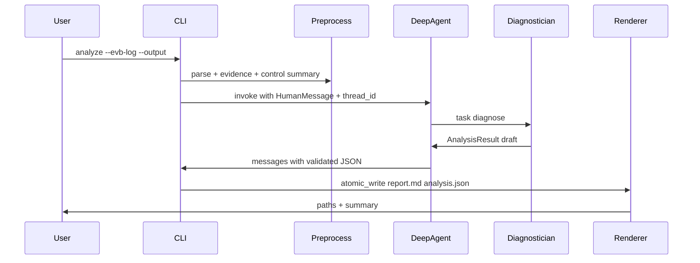

# feat: Wire modem-log-analyzer CLI/Gateway to real AI Agent diagnosis

## Overview

当前 `modem-log-analyzer analyze` 与 Gateway `invoke` 只调用确定性 `AnalysisService`（规则 parser + 关键字分类 + 模板渲染），**从不** `build_agent()` / MiniMax。这与 origin 需求和原 CLI plan 的数据流不符：诊断应由 Agent + diagnostician 产出受 schema 约束的 `AnalysisResult`，CLI 只做 intake、预处理装配、校验与落盘。

本计划把主路径改为：**确定性预处理 → Deep Agent（MiniMax）诊断 → schema 硬校验 → 确定性 renderer**。规则管线降级为 dry-run / 离线单测替身，不得再冒充「Agent 分析」。

**执行约束（仓库硬规矩）**：实现时留在用户当前分支（默认 `main`）；**禁止 AI 擅自 `git checkout -b`**（见根 `AGENTS.md` 硬规矩 9）。

---

## 1. 功能目标

### 业务目标

- 工程师用 CLI（或 Gateway）提交单次 EVB 日志（及可选控制脚本日志）后，由 **AI Agent** 按编排流程读预处理证据、委派 diagnostician、产出可复核的中文 `report.md` + `analysis.json`（see origin: `docs/brainstorms/2026-07-19-nuttx-modem-loop-failure-analysis-agent-requirements.md`）。
- 环境变量与 code-writer / compound-builder 对齐（MiniMax Anthropic-compat）；analyze 路径必须真实发生 LLM 调用（除非显式 `--dry-run`）。

### 本次范围

- CLI `analyze` 默认路径改为 `build_agent()` + LangGraph `invoke`/`stream`。
- Gateway `invoke` / `resume` 与 CLI 共用同一 Agent runner 契约。
- 保留确定性：intake、EVB/control 解析、evidence `EV-NNNN`、命令 catalog、`report.py` 渲染、原子写盘。
- 工具集改为真实 LangChain tools；提供预处理 bundle 与 EVB 切片回读；`validate_analysis_draft` 作为提交前门禁。
- prompt / subagent 模型与 MiniMax 对齐；同步 `docs/PROMPT.md`。
- 真实样本 E2E：`tests/fixtures/e2e_real_samples/auto_case_modem_52_loop75/` + `scripts/e2e_modem_log_analyzer_real.py` 必须证明 Agent 路径。

### 非目标

- 不让 Agent 直接 `write_file` 写报告（产物仍由 CLI/Gateway renderer 落盘）。
- 不删除 parser / catalog；不做「整份 raw log 无预处理塞进 context」的暴力方案。
- 不重做四类业务状态机全量重写；不扩展批量 loop / 跨 loop 统计。
- 不在本计划内改 code-writer / compound-builder。
- 不擅自新建 git branch。

### 已知约束和假设

- Origin 与 `docs/plans/2026-07-19-001-feat-modem-log-analyzer-cli-plan.md` 已规定：预处理确定性 + Agent 诊断 + schema 校验 + 确定性 renderer（see origin + related_plan）。
- `agent.py` 已有 `build_agent()` / diagnostician / `SYSTEM_PROMPT`；缺口是 **CLI/Gateway 未接线**，且 `build_tools()` 目前返回 `SimpleTool`，Deep Agents 可能无法真正调工具。
- 参考模式：`agents/compound-builder/src/compound_builder/cli.py`（`build_agent` + `thread_id` + invoke/stream + dry-run env）。
- 本地/CI：无 key 的默认 pytest 不得依赖真实 MiniMax；真实 LLM 用 `@pytest.mark.llm` 或独立 real E2E 脚本。
- Checkpointer 必开；危险工具仍不得注册；Skills/MCP 仅项目级。

---

## 2. BDD 行为规格

```gherkin
Feature: CLI/Gateway 通过 AI Agent 分析单次 Modem 失败日志
  作为嵌入式测试工程师
  我希望 analyze 走 Deep Agent 诊断而不是纯规则管线
  从而得到符合 schema、可复核证据的报告

  Scenario S1: 默认 analyze 调用 Agent 并产出双产物
    Given 合法 EVB 日志、可写输出目录，且已配置 MiniMax/Anthropic-compat 环境
    And 用户未传 --dry-run
    When 运行 modem-log-analyzer analyze --evb-log ... --output ...
    Then 进程应成功退出
    And 应实际构造并 invoke LangGraph agent（可观测：非 AnalysisService 规则终态冒充）
    And 输出目录含 report.md 与合法 analysis.json
    And analysis.json 通过 AnalysisResult schema 校验且关键结论含真实 EV-NNNN

  Scenario S2: dry-run 不调 LLM、不写产物
    Given 合法 EVB 日志与输出目录
    When 运行 analyze --dry-run
    Then 不得调用 LLM / 不得写入 report.md 或 analysis.json
    And 退出成功或返回可机读的预处理摘要（实现选定一种稳定契约）

  Scenario S3: 非法输入仍在 Agent 之前失败
    Given EVB 不存在、为空、不可读，或输出冲突且未 --overwrite
    When 运行 analyze
    Then 稳定非零退出与可操作错误
    And 不得 build_agent / invoke / 写半成品

  Scenario S4: 预处理证据可供 Agent 工具读取
    Given 已通过 intake 的一次 analyze
    When Agent 调用 get_preprocessed_bundle（或等价工具）
    Then 返回本 run 的命令事件摘要与 evidence_refs（含 EV-NNNN）
    And Agent 可用 read_evb_log_slice 按行号窗口回读原文

  Scenario S5: 非法 AnalysisResult 草稿不得落盘
    Given Agent 返回缺字段、假 EV-NNNN 或非法 classification 的草稿
    When runner 校验
    Then 应拒绝写产物（有界重试后仍失败则显式报错）
    And 不得静默退回纯规则管线结果冒充 Agent 诊断

  Scenario S6: 可选控制日志进入 Agent 上下文
    Given 用户提供 --control-log 且文件合法
    When analyze 运行
    Then preprocess 应解析控制侧直接证据摘要
    And Agent 可通过 read_control_log 或 bundle 字段看到控制侧要点
    And 仅当控制侧有直接证据时 classification 才可为 TEST_AUTOMATION_FAILURE_CONFIRMED

  Scenario S7: Gateway invoke 与 CLI 契约一致
    Given 已上传 EVB artifact 的授权 thread
    When POST .../runs
    Then 使用与 CLI 相同的 Agent runner
    And 响应摘要字段与 analysis.json 契约一致（无原始日志全文）

  Scenario S8: 真实样本主路径
    Given fixtures/e2e_real_samples/auto_case_modem_52_loop75 的 merge.log 与 control_script.log
    And MiniMax 环境可用
    When 运行 scripts/e2e_modem_log_analyzer_real.py（或等价 CLI）
    Then 退出成功且产物存在
    And 报告可读：含命令级时间线要点、控制脚本失败要点、非数千行纯噪声堆砌

  Scenario S9: 合成 e2e_cases 在无 LLM 环境下仍可回归
    Given CI 未配置真实 LLM key
    When 运行现有合成 e2e / Fake agent 路径
    Then 不因缺 key 而红；真实 LLM 场景被标记隔离

  Scenario S10: 工具注册仍无危险工具
    Given build_tools() 与 subagent 工具表
    When 静态检查
    Then 不含 bash / write_file / git_commit / git_push
```

---

## 3. 验收与测试策略

| Scenario | 验收条件 | 推荐测试层级 | 是否需要 E2E |
|---|---|---|---|
| S1 | CLI 默认路径 invoke agent；双产物合法 | 集成（Fake graph）+ 1 条真实 LLM E2E | 是（真实样本） |
| S2 | dry-run 零 LLM、零写盘 | CLI 集成 | 否 |
| S3 | 非法输入在 agent 前失败 | 参数化 CLI 集成（Fake 证明零 invoke） | 否 |
| S4 | preprocess bundle / slice 工具契约 | 单元 + 轻量集成 | 否 |
| S5 | 非法草稿拒写；不静默降级规则结果 | 单元（runner 校验）+ 集成 | 否 |
| S6 | control log 进上下文；自动化分类规则仍硬 | 单元（policy）+ 集成 Fake agent | 否 |
| S7 | Gateway 与 CLI 同 runner | Gateway 集成（Fake agent） | 可选 1 条 | 
| S8 | 真实 merge+control 主路径 | 独立脚本 / `@pytest.mark.llm` | 是 |
| S9 | 无 key CI 不红 | 现有合成 e2e + Fake | 否（合成） |
| S10 | 无危险工具 | 静态单元（已有模式） | 否 |

风险驱动补充：

- **Characterization**：改 CLI 接线前，锁定 Fake AnalysisService 调用次数相关测试的替代契约（改为 Fake `run_agent_analyze`）。
- **Contract**：`AnalysisResult` schema；Gateway 响应字段。
- **Differential**：同一 Fake agent 草稿两次渲染 report 核心字段一致。
- **Fault injection**：validate 失败、agent invoke 抛错、产物冲突。

---

## 4. 需求—测试追踪矩阵

| 需求 | Scenario | 验收测试 | 单元测试 | 集成/契约 | E2E |
|---|---|---|---|---|---|
| Origin R18 CLI 主入口 + 双产物 | S1,S2,S3 | `tests/acceptance/` 或扩展 CLI contract | intake（已有） | `tests/integration/test_cli_analyze.py` | S8 |
| Origin R3–R10 证据/命令/诚实降级 | S4,S5,S6 | runner 校验验收 | tools / validate / policy | Fake agent 诊断集成 | S8 |
| Origin R13–R16 分类与控制日志 | S6,S8 | classification + control 验收 | `test_control_log_policy`（已有增强） | interrupt/resume 集成更新 | S8 |
| 原 plan Agent+diagnostician | S1,S4,S5 | agent_runner 验收 | tool 白名单 | Fake graph invoke | S8 |
| Gateway 契约一致 | S7 | gateway 验收 | — | `tests/integration/test_gateway.py` | 可选 |
| 仓库硬规矩 工具/分支/prompt | S10 | layout/smoke + PROMPT 变更记录 | `test_tool_registry` | — | 否 |

---

## 5. 严格串行开发单元

> 串行门禁：只能 Unit 1 → Unit 2 → … 执行。当前 Unit 的验收、Red→Green→Refactor、相关集成与回归全部完成，才允许进入下一 Unit。禁止并行开发或多 Unit 交替。

### Unit 1 — Agent 工具可被 Deep Agents 真实调用 + 预处理 bundle 契约

- **Unit 目标：** 让 `build_tools()` 返回 Deep Agents / LangGraph 可调用的 LangChain tools；提供本 run 预处理结果的只读访问接口，不接线 CLI。
- **对应 Scenario：** S4、S10。
- **外部可观察结果：** `build_tools()` 工具名白名单稳定；`get_preprocessed_bundle` / `read_evb_log_slice` / 既有 `read_control_log` / `validate_analysis_draft` 可 `invoke`；仍无危险工具。
- **输入与输出：** 输入为已 set 的 run 上下文（evb 路径 + preprocess dict）；输出为工具返回的 JSON/文本。
- **可依赖的已完成能力：** `log_parser`、`evidence`、`command_catalog`、`tools_simple.try_langchain_tool`、`contracts.AnalysisResult`。
- **明确禁止依赖的未来能力：** 不依赖 CLI 改接线、不依赖真实 LLM、不写 report。
- **计划文件：** 修改 `agents/modem-log-analyzer/src/modem_log_analyzer/tools.py`；可选新增 `agents/modem-log-analyzer/src/modem_log_analyzer/run_context.py`（或等价模块）保存当前 preprocess；修改 `tests/unit/test_tool_registry.py`；新增 `tests/unit/test_preprocess_tools.py`。
- **验收测试：** 工具列表不含 bash/write_file/git_*；bundle 在 set context 后可读；未 set context 时返回稳定错误。
- **需要拆分的单元测试：** try_langchain_tool 路径；slice 行号边界；超大文件截断。
- **Red 预期失败原因：** 当前 `build_tools` 只返回 SimpleTool；无 bundle/slice。
- **最小实现范围：** 4 个只读工具 + run context；不改 CLI。
- **TDD 闭环：** (1) 启用工具/白名单验收 (2) Red (3) 拆单测 (4) R→G→R (5) 工具集成冒烟 (6) 回归既有 tool 测试 (7) 关闭 (8) 进 Unit 2。
- **集成验证：** 在测试中 set context 后依次 invoke 四个工具。
- **回归范围：** `test_tool_registry`、layout/smoke 相关断言。
- **完成标准：** 工具可被 langchain 风格 invoke；无危险工具；无 skip。
- **风险与注意事项：** run context 必须 thread/run 隔离，避免并行测试串数据。

### Unit 2 — Agent runner：preprocess → invoke → schema 校验（Fake graph）

- **Unit 目标：** 新增稳定编排入口（建议 `agent_runner.py`）：确定性 preprocess + `build_agent` invoke + 从消息中提取并校验 `AnalysisResult`；非法草稿拒写。
- **对应 Scenario：** S1（Fake）、S5、S6（Fake）。
- **外部可观察结果：** `run_agent_analyze(...)` 返回合法 dict；Fake graph 返回非法 JSON 时抛明确错误且不写盘。
- **输入与输出：** 与现 CLI 相同的路径参数；输出 `AnalysisResult` dict（含 evidence_refs 来自 preprocess，诊断字段来自 Agent）。
- **可依赖的已完成能力：** Unit 1 工具与 context；现有 `analysis_service` 中的 preprocess 逻辑可抽取复用（parser/evidence/control parse）。
- **明确禁止依赖的未来能力：** 不改 CLI 默认入口（Unit 3）；不要求真实 MiniMax。
- **计划文件：** 创建 `agents/modem-log-analyzer/src/modem_log_analyzer/agent_runner.py`；从 `analysis_service.py` 抽出 `preprocess_evb_run`（或等价）供 runner 与规则替身共用；新增 `tests/unit/test_agent_runner.py`、`tests/integration/test_agent_runner_fake.py`。
- **验收测试：** Fake agent 产出合法草稿 → runner 返回可渲染 dict；假 EV-NNNN → 失败；缺 classification → 失败；有界重试次数固定。
- **需要拆分的单元测试：** 消息 JSON 提取；validate 门禁；control 摘要注入 HumanMessage 的字段形状。
- **Red 预期失败原因：** runner 模块不存在；CLI 仍只调规则服务。
- **最小实现范围：** Fake 可测的 runner；真实 `build_agent` 调用点留在同一函数内但测试 monkeypatch。
- **TDD 闭环：** 标准 8 步；集成用 Fake graph。
- **集成验证：** Fake 成功路径 + Fake 非法草稿路径。
- **回归范围：** 不破坏现有 AnalysisService 单测（可暂时并存）。
- **完成标准：** S5 验收绿；无静默规则回退。
- **风险与注意事项：** **禁止**「Agent 失败则自动 AnalysisService.run_analyze 冒充成功」；失败必须显式。

### Unit 3 — CLI analyze 默认接线 Agent runner

- **Unit 目标：** `cli.analyze` 默认调用 Unit 2 runner；`--dry-run` 不调 LLM、不写盘；非法输入仍零 agent 调用。
- **对应 Scenario：** S1、S2、S3。
- **外部可观察结果：** 终端可打印 model/base_url；成功写双产物；Fake 证明默认路径调用 `run_agent_analyze` 而非规则终态。
- **输入与输出：** 现有 CLI 参数不变。
- **可依赖的已完成能力：** Unit 2 runner；现有 intake / report / atomic_write。
- **明确禁止依赖的未来能力：** 不改 Gateway（Unit 4）；不要求本 Unit 真实 LLM E2E。
- **计划文件：** 修改 `agents/modem-log-analyzer/src/modem_log_analyzer/cli.py`；更新 `tests/integration/test_cli_intake.py`、`tests/integration/test_cli_analyze.py`、`tests/acceptance/test_cli_contract.py`（Fake runner）。
- **验收测试：** monkeypatch runner：合法路径调用 1 次；非法路径 0 次；dry-run 0 次 LLM/写盘。
- **需要拆分的单元测试：** 无（以 CLI 集成为主）。
- **Red 预期失败原因：** CLI 仍实例化 `AnalysisService` 作为唯一路径。
- **最小实现范围：** 接线 + dry-run 语义对齐 compound-builder（env 或显式分支）。
- **TDD 闭环：** 标准 8 步。
- **集成验证：** Fake runner 全 CLI 主路径。
- **回归范围：** 既有 CLI contract、intake 参数化。
- **完成标准：** S1–S3（Fake）绿。
- **风险与注意事项：** help 文案更新为「默认走 Agent；dry-run 跳过 LLM」。

### Unit 4 — Gateway invoke/resume 共用 Agent runner

- **Unit 目标：** Gateway 与 CLI 同一 runner；未授权仍拒绝；响应无原始日志全文。
- **对应 Scenario：** S7、S3（鉴权边界）。
- **外部可观察结果：** `POST .../runs` 与 resume 走 runner；Fake 可测。
- **输入与输出：** 现有 multipart artifact 契约不变。
- **可依赖的已完成能力：** Unit 2–3；现有 `gateway/api/routers/modem_log_analyzer.py`。
- **明确禁止依赖的未来能力：** 不依赖真实 LLM E2E（Unit 5）。
- **计划文件：** 修改 `gateway/api/routers/modem_log_analyzer.py`；更新 `agents/modem-log-analyzer/tests/integration/test_gateway.py`。
- **验收测试：** Fake runner 被调用；鉴权失败零 runner；resume 带 control artifact。
- **需要拆分的单元测试：** request→runner 参数映射。
- **Red 预期失败原因：** router 仍直接 `AnalysisService()`。
- **最小实现范围：** 替换调用点；保持响应 schema。
- **TDD 闭环：** 标准 8 步。
- **集成验证：** TestClient 全链路 Fake。
- **回归范围：** 既有 gateway 路由测试、跨 Agent 无关。
- **完成标准：** S7 绿。
- **风险与注意事项：** 不引入跨 Agent import；staging 目录清理策略不变。

### Unit 5 — Prompt/Subagent 模型对齐 + 规则管线降级命名

- **Unit 目标：** diagnostician 默认模型走 MiniMax env；prompt 写明 CLI/Gateway 主路径必须 invoke Agent；规则 `AnalysisService` 降级为明确的 preprocess/dry-run/test 替身命名，避免误用。
- **对应 Scenario：** S1、S10（文档与行为一致）。
- **外部可观察结果：** `docs/PROMPT.md` 有变更记录；subagent 不再写死 haiku（除非 env 覆盖）；文档 README 说明主路径=Agent。
- **输入与输出：** 环境变量 `ATELIER_DEFAULT_MODEL` / `ATELIER_SUBAGENT_MODEL` / `ANTHROPIC_*`。
- **可依赖的已完成能力：** Unit 3–4。
- **明确禁止依赖的未来能力：** 不在本 Unit 做真实样本质量调优（Unit 6）。
- **计划文件：** 修改 `subagents.py`、`prompts.py`、`docs/PROMPT.md`、`docs/README.md`、`docs/TESTING.md`、`analysis_service.py`（降级/重命名说明）。
- **验收测试：** prompt 文件含「CLI 必须 invoke Agent」类断言（静态）；模型 resolve 单测。
- **需要拆分的单元测试：** `resolve_default_model` / subagent model env。
- **Red 预期失败原因：** prompt/README 仍描述纯规则主路径。
- **最小实现范围：** 文案 + env 对齐；不改 schema。
- **TDD 闭环：** 标准 8 步。
- **集成验证：** 导入 build_agent 不炸（可无网络）。
- **回归范围：** prompt 静态测试、llm resolve。
- **完成标准：** 文档与代码主路径描述一致；PROMPT 变更表追加。
- **风险与注意事项：** 改 prompt 必同步 PROMPT.md（硬规矩 3）。

### Unit 6 — 真实样本 Agent E2E + 合成路径隔离

- **Unit 目标：** 用 `e2e_real_samples/auto_case_modem_52_loop75` 证明真实 MiniMax Agent 路径；合成 `e2e_cases` / 默认 pytest 在无 key 时仍绿。
- **对应 Scenario：** S8、S9。
- **外部可观察结果：** `scripts/e2e_modem_log_analyzer_real.py` 走 Agent；产物存在；报告含命令与控制侧要点；CI 默认不全量打真实 LLM。
- **输入与输出：** merge.log、control_script.log、modemcli_commands.md（知识已在 catalog）。
- **可依赖的已完成能力：** Unit 1–5。
- **明确禁止依赖的未来能力：** 不把报告美观度大重构塞进本 Unit（可读性已有一轮；本 Unit 只要求 Agent 路径可验收）。
- **计划文件：** 修改 `scripts/e2e_modem_log_analyzer_real.py`；可选 `tests/e2e/test_agent_llm_real.py`（`@pytest.mark.llm`）；更新 TESTING.md。
- **验收测试：** 有 key 时脚本 exit 0；断言 classification 为 6 枚举之一且 evidence 非空；无 key 时脚本明确 skip/提示而非 traceback 冒充 PASS。
- **需要拆分的单元测试：** 无。
- **Red 预期失败原因：** real 脚本仍只跑规则 AnalysisService。
- **最小实现范围：** 接线证明 + 门禁文档。
- **TDD 闭环：** 真实 E2E 作最终验收；合成回归全绿。
- **集成验证：** 本地一次真实 MiniMax 跑通。
- **回归范围：** 全包 pytest（无 llm mark）；gateway Fake；CLI Fake。
- **完成标准：** S8 在有 key 环境通过；S9 CI 友好。
- **风险与注意事项：** 真实日志含 PII——报告本地可保真，终端/trace 继续脱敏；费用与超时（invoke timeout）记入剩余风险。

每个 Unit 必须执行的 TDD 闭环（不得跳过）：

1. 编写/启用当前行为验收测试  
2. 运行并确认以正确原因失败  
3. 拆最小单元测试  
4. 逐个 Red → Green → Refactor  
5. 跑本 Unit 相关集成测试  
6. 跑受影响回归  
7. 满足完成标准后关闭 Unit  
8. 再进入下一 Unit  

禁止：删弱断言、skip、`.only`、无解释改 golden、Mock 掉待验证行为、只跑局部就宣称完成。

---

## 6. 最终质量门禁

- S1–S10 计划内 Scenario 全部有对应测试或显式隔离策略（真实 LLM 仅 S8）。
- 全包默认 pytest 通过；无新增失败/skip（llm 标记除外且有文档）。
- CLI Fake 路径证明默认调用 Agent runner；非法输入零 invoke。
- Gateway Fake 与 CLI 契约一致。
- 有 MiniMax key 时 real sample 脚本通过，产物 `report.md` + `analysis.json` schema 合法。
- `make format` / ruff / mypy（包内既有门禁）通过。
- 无危险工具；prompt 变更已记 `docs/PROMPT.md`。
- 未验证项明确列出：真实 Postgres checkpointer 跨进程 resume、LangSmith 线上 A/B、报告叙事质量的持续调优、IMS 噪声进一步压缩。
- 不擅自开 git branch；在用户指定分支上提交。

---

## High-Level Technical Design

> *Directional guidance for review, not implementation specification.*

```text
CLI/Gateway
  -> intake.validate
  -> preprocess_evb_run(evb[, control])   # deterministic
  -> run_context.set(bundle)
  -> build_agent().invoke(messages, thread_id)
        tools: get_preprocessed_bundle | read_evb_log_slice
               | read_control_log | validate_analysis_draft
        subagent: diagnostician
  -> extract JSON -> AnalysisResult.model_validate
  -> report.atomic_write_artifacts
  -> terminal summary (redacted)
```



### Patterns to follow

- `agents/compound-builder/src/compound_builder/cli.py` — `build_agent` + invoke/stream + dry-run env  
- `agents/modem-log-analyzer/src/modem_log_analyzer/agent.py` — existing `build_agent`  
- `agents/modem-log-analyzer/src/modem_log_analyzer/report.py` — deterministic render  
- `agents/modem-log-analyzer/src/modem_log_analyzer/contracts.py` — `AnalysisResult` SSOT  

### Alternative rejected

- **仅加大规则引擎**：违背「必须 AI Agent 读 log 分析」的产品意图。  
- **Agent 直接写文件**：违背只读 Agent 与 CLI 落盘边界。  
- **失败自动回退规则结果**：会掩盖 Agent 故障，禁止。

---

## System-Wide Impact

- **Interaction graph：** CLI、Gateway router、`agent.py` 图、tools、LangSmith tracing。  
- **Error propagation：** intake 错误码保持；runner/LLM 错误映射为稳定非零退出，不写半成品。  
- **State lifecycle：** run_context 必须在 invoke 结束清理；checkpointer thread_id 隔离。  
- **API surface parity：** Gateway 与 CLI 同 runner。  
- **Unchanged invariants：** console script 名、`--evb-log/--output` 契约、六分类枚举、无危险工具、项目级 Skills/MCP。

---

## Risks & Dependencies

| Risk | Mitigation |
|------|------------|
| MiniMax/API 不稳定或慢 | timeout/retries；E2E 独立脚本；CI 默认 Fake |
| Agent 输出不稳定 | schema 硬校验 + 有界重试；evidence ref 必须来自 preprocess |
| SimpleTool 导致「看似有工具实则未调」 | Unit 1 强制 LangChain tool |
| 误用规则管线冒充 Agent | 命名降级 + CLI Fake 断言调用点 |
| PII 进 trace | 继续只上送摘要；真实样本勿默认上传全文 |
| AI 擅自开 branch | 硬规矩 9；本计划明确在当前分支执行 |

---

## Documentation / Operational Notes

- 更新 `agents/modem-log-analyzer/docs/README.md`、`TESTING.md`、`PROMPT.md`、`INTERRUPTS.md`（若 interrupt 行为随 Agent 路径变化）。  
- 真实 E2E：`scripts/e2e_modem_log_analyzer_real.py` + `tests/fixtures/e2e_real_samples/auto_case_modem_52_loop75/`。  
- 运维：需配置与其它 CLI 相同的 `ANTHROPIC_*` / `ATELIER_DEFAULT_MODEL`。

---

## Sources & References

- **Origin：** [docs/brainstorms/2026-07-19-nuttx-modem-loop-failure-analysis-agent-requirements.md](docs/brainstorms/2026-07-19-nuttx-modem-loop-failure-analysis-agent-requirements.md)  
- **Related plan：** [docs/plans/2026-07-19-001-feat-modem-log-analyzer-cli-plan.md](docs/plans/2026-07-19-001-feat-modem-log-analyzer-cli-plan.md)  
- **Patterns：** `agents/compound-builder/src/compound_builder/cli.py`、`agents/modem-log-analyzer/src/modem_log_analyzer/{cli,agent,analysis_service,tools,report}.py`  
- **Hard rules：** `AGENTS.md` §1–9（含禁止擅自开 branch）  
