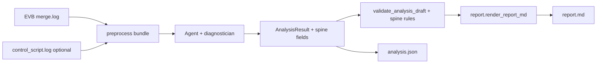

# Modem Report Timeline Spine - Plan

## Goal Capsule

- **Objective:** 优化 `modem-log-analyzer` Agent，使报告以设备侧失败时间线为主轴，让自动化与研发同事能快速看清测试流程、故障步，以及可对上设备 log 的证据块。
- **Product authority:** 本文件 Product Contract；上游 origin 与既有 CLI plan 仍约束「结构化诊断 + 确定性渲染」与只读分析边界。
- **Open blockers:** 无。
- **Stop conditions:** Definition of Done 全部满足；不得跳过 Unit 串行门禁。

---

## Product Contract

### Summary

以设备侧**失败时间线**作为报告叙事脊椎：领口先交代已确认现象/影响与（必要时降级的）疑似根因，再用一行短流程 + 带故障标记的时间线讲清「测了什么、哪步出问题」，并按测试步骤分块粘贴设备 log 原文。控制脚本不贴原文；本轮不收紧分类标签纪律，也不要求「建议下一步」。

### Problem Frame

对真实样本（如 `auto_case_modem_52_loop75`）跑出的报告，自动化/研发同事无法一眼接手：场景长文重复、时间线空洞、证据与摘要对不齐或贴出空命令行，导致「root cause 是什么、导致了什么」读不出来。问题出在 Agent 的分析与出报告能力，而不是某一次人工改稿。

### Key Decisions

- **时间线当脊椎，而非再堆平行章节。** 流程与故障步是第一目标；长段「推断场景」默认压短/降级，避免与领口、时间线三重重复。
- **低置信时领口拆两句。** 先写已确认的现象/影响，再写「疑似」根因并标明低置信；不装作已坐实。
- **证据只贴设备 log，按步骤分块。** 故障步块更详并带前后对照；控制脚本可参与理解外部 FAIL，但不在报告中贴原文。
- **不要求建议行动。** 本轮成功标准是讲明白流程与故障点，不是给下一步工单。
- **本轮不做分类纪律收紧。** `CONFIRMED` 等归因标签语义、强制「判定闭环」证据清单留给后续。

### Actors

- A1. 自动化测试同事 — 需要快速理解外部 FAIL 对应哪步设备现象。
- A2. Modem / 平台研发 — 需要板端故障步与可复核的设备 log 块。
- A3. `modem-log-analyzer` Agent — 只读分析设备（及可选控制）日志，产出结构化诊断并由确定性渲染生成报告。

### Requirements

**领口与置信度**

- R1. 报告领口必须让读者在不读后文的情况下复述：外部结果（若已知）+ 板端在哪一步偏离预期。
- R2. 当根因置信度为 low 时，领口必须先陈述已确认现象/影响，再陈述疑似根因，并使用明确的「疑似」措辞；不得用已确认语气包装低置信归因。
- R3. 当根因置信度足以主张时，领口仍须遵循「根因是什么 → 导致了什么问题」的顺序。
- R4. 领口须含一行短流程摘要（例如 Data 检查 → ping → SMS），点明本次测试在做什么。

**时间线脊椎**

- R5. 正文必须有非空的失败时间线，按测试执行顺序串起关键步骤。
- R6. 时间线上必须明确标记故障步（出问题的那一步）。
- R7. 领口短流程、领口结论与时间线不得互相矛盾；长段场景叙述不得重复同一段话三次。
- R8. 时间线是叙事主轴：其它叙述性章节（如长推断场景）相对时间线降级或压短，不得喧宾夺主。

**设备 log 证据分块**

- R9. 报告必须按测试步骤分块粘贴设备 log 原文（非仅 EV 编号或空命令提示符）。
- R10. 故障步对应的证据块须更完整，并包含前后对照小块。
- R11. 领口中每个关键断言必须有可复核的设备侧证据引用，且引用原文能支撑该断言（禁止空壳 `modemcli>`、禁止摘要与行号/引用 ID 对不上）。
- R12. 控制脚本日志不得作为分块粘贴内容出现在报告中；若使用控制侧信息解释外部 FAIL，仅允许摘要提及，不贴控制脚本原文。

**产物与边界继承**

- R13. 诊断事实仍须落入结构化结果，并由确定性 renderer 生成中文 `report.md`；Agent 不得直接写任意最终报告文件。
- R14. Agent 保持只读分析器边界：不读自动化测试源码、不操作 EVB、不把未知协议语义当事实。
- R15. 本轮不要求「建议行动」章节提供可执行下一步；该章节可空或弱化，不得因此判定本轮失败。

### Key Flows

- F1. 单次失败分析的阅读路径
  - **Trigger:** A1/A2 打开一次 analyze 产物报告。
  - **Actors:** A1, A2, A3
  - **Steps:** 读领口两句与一行流程 → 扫时间线定位故障步 → 打开该步及前后的设备 log 分块复核。
  - **Outcome:** 无需先翻完整原始 log，即可复述流程与故障点，并能用设备原文核对领口断言。
  - **Covered by:** R1–R12

- F2. 低置信归因表达
  - **Trigger:** A3 对根因仅有 low 置信度。
  - **Actors:** A3, A1, A2
  - **Steps:** 写出已确认现象/影响 → 写出疑似根因并标明低置信 → 时间线仍标出故障步与设备证据块。
  - **Outcome:** 读者分得清「已确认」与「猜测」，不会把低置信当定论。
  - **Covered by:** R2, R5, R6, R9–R11

### Acceptance Examples

- AE1. Covers R1, R2, R4–R6, R9–R12
  - **Given:** 类似 `auto_case_modem_52_loop75` 的输入（设备 log + 可选控制脚本），外部结果为 FAIL，板端 ping 出现首包超时且后续多数恢复。
  - **When:** Agent 完成分析并渲染报告。
  - **Then:** 领口能复述外部 FAIL 与板端偏离步；低置信时疑似根因带「疑似」；一行短流程存在；时间线非空且标故障步；设备 log 按步骤分块且故障步更详带前后对照；控制脚本原文未贴出。

- AE2. Covers R7, R8, R11
  - **Given:** 同上输入。
  - **When:** 审阅报告叙事与证据。
  - **Then:** 不出现同一场景长文三重粘贴；领口关键断言的证据原文能支撑断言，且无空命令提示符冒充证据。

- AE3. Covers R15
  - **Given:** 同上输入且建议行动为空。
  - **When:** 按本轮成功标准验收。
  - **Then:** 不以缺少建议行动判定失败。

### Success Criteria

- 自动化或研发同事打开报告后，约 10 秒内能说出：测试流程是什么、问题出在哪一步。
- 领口关键断言均可在报告内的设备 log 分块中核对原文。
- 以 `auto_case_modem_52_loop75`（或同等真实样本）作为回归锚点时，不再出现「时间线无关键业务事件」而领口却声称完整故障叙事的组合。

### Scope Boundaries

**In scope**

- 优化 Agent 的诊断叙事与证据选择，使时间线脊椎 + 领口 + 设备 log 分块满足上述要求。
- 共用一份报告同时服务 A1 与 A2。

**Deferred for later**

- 收紧 `TEST_AUTOMATION_FAILURE_CONFIRMED` 等分类标签与置信度语义纪律。
- 强制粘贴「判定闭环」类证据清单（例如 ping 汇总行作为独立硬门禁）。
- 诊断与证据打包两段式管线。
- 建议行动的质量与必填策略。

**Outside this round**

- 手改某一份已生成报告（如 `out/real_case_52`）作为交付。
- 批量 loop / 跨 loop 统计、读取自动化测试源码、操作 EVB。

### Dependencies / Assumptions

- 既有契约仍成立：结构化诊断为事实来源，`report.md` 由确定性 renderer 生成（见 related plans）。
- 控制脚本可选；即使提供，本轮报告仍不贴其原文。
- 「设备 log」指板端/EVB 合并日志（如 fixture 中的 `merge.log`），不是控制脚本。

### Sources / Research

- Origin 需求 R19–R25：`docs/brainstorms/2026-07-19-nuttx-modem-loop-failure-analysis-agent-requirements.md`
- CLI / Agent 接线计划：`docs/plans/2026-07-19-001-feat-modem-log-analyzer-cli-plan.md`，`docs/plans/2026-07-21-001-feat-agent-driven-cli-analyze-plan.md`
- 只读边界：`agents/modem-log-analyzer/AGENTS.md`
- 真实样本：`agents/modem-log-analyzer/tests/fixtures/e2e_real_samples/auto_case_modem_52_loop75/`
- Brainstorm 对照样本（空时间线/空建议）：仓库根 `out/real_case_52/`（非正式 fixture）
- 现有实现锚点：`agents/modem-log-analyzer/src/modem_log_analyzer/{contracts,report,prompts,tools,agent_runner}.py`

---

## Planning Contract

### Key Technical Decisions

- **KTD1. 扩展 `AnalysisResult`，不另起报告 DSL。** 新增可选字段承载 Timeline Spine（见 HTD）；`report.md` 仍由 `report.render_report_md` 确定性渲染。理由：沿用 SSOT + 原子写盘既有模式，避免 Agent 直接写报告。
- **KTD2. 章节标题集保持兼容，内容职责重排。** 保留 `REPORT_SECTIONS` 十章标题（兼容既有契约测试与 R19），但「失败概览」改为领口（确认/疑似 + 一行流程）；「推断的测试场景与基线」压短为流程/动作摘要；「失败时间线」成为脊椎并标记故障步；「测试步骤与日志证据」改为按步骤的设备 log 分块（含故障前后对照）。理由：满足 R8 又不强制一次性改章节名导致大面积 golden 失效。
- **KTD3. `EvidenceBlock` 结构化分块，禁止控制脚本进块。** 新增 `evidence_blocks`（步骤标签、`ref_ids`、`role=main|before|after`、`is_failure_step`）。渲染只贴 `evidence_refs` 中设备侧 `raw_text`；`source` 指向控制脚本的引用不得进入分块正文。理由：落实 R9–R12。
- **KTD4. Spine 硬校验放在 `validate_analysis_draft` 路径。** 在 schema 校验之外增加可测试规则：外部 FAIL 且声称有板端偏离时 `timeline` 非空；至少一处 `is_failure_step`；领口字段与引用一致性；空壳 `modemcli>` 不得作为断言唯一支撑。理由：把 R5/R6/R11 变成 Agent 提交前门禁，而不是事后人工挑刺。
- **KTD5. 回归以确定性渲染 + 草稿门禁为主，真实 LLM E2E 可选。** 用合成 `AnalysisResult` / fixture 草稿驱动 ATDD；不把 MiniMax 调用作为 Unit 关闭条件。理由：成本与稳定性；真实 Agent 路径已有独立 E2E 脚本可另跑。

### High-Level Technical Design

数据流（既有管线 + Spine 字段）：



领口渲染规则（方向性伪码，非实现规格）：

```text
if root_cause_confidence == "low":
  lead = confirmed_impact 然后 "疑似" + suspected_root_cause
else:
  lead = suspected_root_cause/根因主张 然后 导致的影响
lead 必须含 flow_one_liner
timeline 中 is_failure_step=true 的步骤必须出现在证据分块的故障主块
```

### Assumptions

- 现有 `TimelineEvent` / `EvidenceRef` 可向后兼容扩展可选字段；旧 fixture 在缺省字段下仍能 `model_validate`。
- `business_actions` / `control_evidence` 继续作为 schema 外扩展字段由 runner 合并（与现状一致），本轮不强制进 Pydantic 必填。
- 「空壳证据」判定：剥除 ANSI/空白/`modemcli>` 提示符后无实质报文内容。

### Alternatives Considered

- **仅改 prompt、不改 schema：** 否决——无法对时间线非空与证据分块做硬门禁，易退回空洞时间线。
- **两段式「诊断 + 证据打包」：** 否决（Product Contract Deferred）——本轮范围过大。
- **重命名/删除报告章节：** 否决——破坏 R19 与大量 renderer 测试；改为同名异责。

---

## 1. 功能目标

### 业务目标

- 让 A1/A2 打开 `report.md` 后约 10 秒内能说出测试流程与故障步，并能用设备 log 分块核对领口断言。
- 优化的是 Agent 的分析与出报告能力（schema → 校验 → 渲染 → prompt），不是手改 `out/real_case_52`。

### 本次范围

- 扩展结构化诊断字段与 spine 校验。
- 重排确定性报告内容（领口 / 压短场景 / 故障时间线 / 设备证据分块）。
- 更新 diagnostician / 系统提示与 `agents/modem-log-analyzer/docs/PROMPT.md`。
- ATDD 覆盖 AE1–AE3；回归既有 `tests/unit/test_report_renderer.py` 等。

### 非目标

- 分类标签纪律收紧、建议行动必填、控制脚本原文分块、两段式证据管线、批量 loop 统计、读测试源码、操作 EVB。
- 本计划不编写生产代码；Executor 按 Unit 串行实现。

### 已知约束和假设

- 硬规矩：只读分析器；`AnalysisResult` SSOT；禁止 Agent 直接写最终报告；prompt 改动必须记 `agents/modem-log-analyzer/docs/PROMPT.md`。
- 仓库禁止 AI 擅自开 git branch（根 `AGENTS.md` 硬规矩 9）。
- 执行方向：**每个 Unit 强制 TDD（Red → Green → Refactor）+ 受影响回归**；Outside-In 从报告外部行为切入。

---

## 2. BDD 行为规格

```gherkin
Feature: Timeline Spine 报告叙事
  作为自动化或 Modem 研发同事
  我希望报告以设备侧时间线讲清流程与故障步，并贴出可复核的设备 log 分块
  从而不必先翻完整原始 log 也能接手一次 FAIL

  Scenario S1: 低置信时领口拆成「已确认 → 疑似根因」并含一行流程
    Given 一份合法 AnalysisResult，root_cause_confidence 为 low
    And confirmed_impact、suspected_root_cause、flow_one_liner 已填充
    When 确定性 renderer 生成 report.md
    Then 「失败概览」领口先出现已确认现象/影响
    And 随后出现带「疑似」措辞的根因句
    And 领口含一行短流程摘要
    And 不得用已确认语气包装低置信根因

  Scenario S2: 高/中置信时领口按「根因 → 影响」
    Given root_cause_confidence 为 medium 或 high
    And 根因与影响字段已填充
    When 渲染 report.md
    Then 领口先陈述根因主张，再陈述导致的问题

  Scenario S3: 失败时间线非空且标记故障步
    Given external_result 为 FAIL 且诊断声称板端偏离
    And timeline 含多个步骤且恰有故障步标记
    When 渲染 report.md
    Then 「失败时间线」不为「无关键业务事件」
    And 故障步在时间线上有明确标记
    And 时间线顺序与测试执行一致

  Scenario S4: 设备 log 按步骤分块，故障步含前后对照
    Given evidence_blocks 按步骤组织，故障步含 main/before/after
    And evidence_refs 提供设备侧 raw_text
    When 渲染「测试步骤与日志证据」
    Then 按测试步骤分块展示设备原文
    And 故障步块更完整并含前后对照
    And 分块中不出现控制脚本原文

  Scenario S5: 空壳证据不得支撑领口断言
    Given 某 EvidenceRef 的 raw_text 仅为空 modemcli 提示符
    And 领口关键断言仅引用该 ref
    When 运行 spine 校验（validate 路径）
    Then 校验失败并指出空壳证据 / 断言无支撑

  Scenario S6: 长场景不得三重重复
    Given scenario 长文与领口、时间线描述同一事实
    When 渲染 report.md
    Then 「推断的测试场景与基线」为压短摘要
    And 不得把同一长段落完整复制到概览与场景与诊断三处

  Scenario S7: 建议行动可空
    Given suggested_actions 为空
    When 按本轮成功标准验收
    Then 不以缺少建议行动判定失败

  Scenario S8: 非法草稿被拒
    Given timeline 为空但声称存在板端偏离
    When validate_analysis_draft / spine 规则执行
    Then 返回 INVALID，并说明时间线脊椎不满足

  Scenario S9: 既有章节标题契约不回归
    Given 任意合法 AnalysisResult（含旧字段最小集）
    When 渲染 report.md
    Then 仍包含既有 REPORT_SECTIONS 十个中文章节标题（顺序不变）
```

---

## 3. 验收与测试策略

| Scenario | 验收条件 | 推荐测试层级 | 是否需要 E2E |
| -------- | ---- | ------ | -------- |
| S1 | 低置信领口顺序 +「疑似」+ 一行流程 | 单元（renderer） | 否 |
| S2 | 中/高置信领口「根因→影响」 | 单元（renderer） | 否 |
| S3 | 时间线非空 + 故障步标记 | 单元（renderer）+ 单元（validator） | 否 |
| S4 | 步骤分块 + 前后对照 + 无控制脚本原文 | 单元（renderer） | 否 |
| S5 | 空壳证据被拒 | 单元（validator） | 否 |
| S6 | 场景节压短、无三重长文 | 单元（renderer） | 否 |
| S7 | 建议行动可空仍验收通过 | 单元（renderer / 契约说明） | 否 |
| S8 | 空时间线草稿 INVALID | 单元（validate tool / spine rules） | 否 |
| S9 | 十章标题仍在 | 单元（renderer 回归） | 否 |
| AE1 锚点 | case52 风格合成草稿渲染满足领口/时间线/分块 | 单元 + 可选集成（无 LLM） | 可选真实 LLM（非门禁） |

---

## 4. 需求—测试追踪矩阵

| 需求 | Scenario | 验收测试 | 单元测试 | 集成/契约测试 | E2E |
| -- | -------- | ---- | ---- | ------- | --- |
| R1–R4 | S1, S2 | `test_report_timeline_spine.py` 领口断言 | renderer 领口分支 | — | 可选 |
| R5–R6 | S3, S8 | 同上时间线断言 + validator | renderer + spine_validate | — | 否 |
| R7–R8 | S6, S9 | 场景压短 + 章节标题 | renderer | — | 否 |
| R9–R12 | S4, S5 | 分块与控制脚本排除 | renderer + validator | — | 否 |
| R13 | S9 | schema → render 不写文件 | contracts + renderer | agent_runner 字段透传 | 否 |
| R14 | — | 既有 AGENTS/tool 约束不回退 | test_tool_registry / prompts | — | 否 |
| R15 | S7 | 空 suggested_actions 可渲染 | renderer | — | 否 |
| AE1–AE3 | S1–S7 | case52 风格 fixture 草稿 | 结构测试 | 可选 stub runner | 可选 |

---

## Implementation Units

> **串行门禁：** Unit N 的实现、测试、重构与回归全部通过后，才能开始 Unit N+1。禁止并行交替。每个 Unit 必须完成完整 TDD 闭环。

### U1. Outside-In：Timeline Spine 报告验收测试（先红）

- **Goal:** 用合成 `AnalysisResult` dict 锁定 AE1/AE2/AE3 在 `report.md` 上的外部可观察行为；测试先以正确原因失败。
- **Requirements:** R1–R12, R15; F1; AE1–AE3; S1–S7, S9
- **Dependencies:** 无（仅依赖现有 `render_report_md` 可导入）
- **Files:**
  - create: `agents/modem-log-analyzer/tests/unit/test_report_timeline_spine.py`
  - create: `agents/modem-log-analyzer/tests/fixtures/reports/timeline_spine_case52_draft.json`（合成草稿，非手改 out/）
  - modify: 无生产代码（本 Unit 结束时测试仍红，或仅加最小 skip 以外的失败断言——**禁止 skip**；允许生产代码尚未实现导致 Import/Assertion 失败）
- **Approach:** Outside-In。先写 Given/When/Then 级断言：领口关键字、「疑似」、`flow` 一行、时间线非空与故障标记、证据分块标题、无控制脚本特征串、建议行动可空、十章标题仍在。fixture 描述**目标**数据结构（可含尚未存在的键）。
- **Execution note:** Start with failing acceptance tests for the report contract; do not implement renderer yet in this unit beyond what is required to keep the suite collectable.
- **对应 Scenario:** S1–S4, S6–S7, S9（及 AE1–AE3 的渲染结构）；**不含** S5/S8（校验门禁属 U4）
- **外部可观察结果:** pytest 收集并运行新测试文件；断言失败信息指向「缺失领口/时间线/分块」而非 import 崩坏（若键不存在，断言应清晰）。
- **输入与输出:** 输入合成 JSON → 调用 `render_report_md` → 期望中文报告片段。
- **可依赖的已完成能力:** 现有 `report.render_report_md`、`REPORT_SECTIONS`。
- **明确禁止依赖的未来能力:** 不得依赖 U2+ 的新 validator/prompt；不得调用真实 LLM；不得在本 Unit 断言 validate 路径行为。
- **验收测试:** `test_report_timeline_spine.py` 中的 ATDD 用例。
- **需要拆分的单元测试:** 本 Unit 以验收级用例为主；细粒度分支留给 U2/U3。
- **Red 预期失败原因:** 当前 renderer 领口仍堆长 `scenario`、时间线可空、证据未按步骤分块、无「疑似」领口结构。
- **最小实现范围:** 仅测试与 fixture；**不**改 `report.py`（若必须改测试辅助，不得把功能做完）。
- **集成验证:** 无。
- **回归范围:** 确认既有 `tests/unit/test_report_renderer.py` 仍绿（本 Unit 不改生产代码时应保持绿）。
- **完成标准:** 新 ATDD 测试存在且失败原因正确；旧 renderer 测试全绿；无 skip/xfail 掩盖。
- **风险与注意事项:** fixture 不要从 `out/real_case_52` 原样拷贝错误证据；按 AE 手工构造「正确目标草稿」；U1 需创建 `tests/fixtures/reports/` 目录。

### U2. Schema：Spine 字段进入 `contracts.py`

- **Goal:** 让目标草稿可被 `AnalysisResult.model_validate` 接受，并向后兼容旧最小结果。
- **Requirements:** R13; 支撑 R1–R12 的数据结构
- **Dependencies:** U1
- **Files:**
  - modify: `agents/modem-log-analyzer/src/modem_log_analyzer/contracts.py`
  - modify: `agents/modem-log-analyzer/tests/unit/test_contracts.py`
  - modify: `agents/modem-log-analyzer/tests/fixtures/reports/timeline_spine_case52_draft.json`（对齐最终字段名）
- **Approach:** 扩展可选字段（名称以实现时为准，语义固定）：
  - `flow_one_liner`
  - `confirmed_impact`
  - `suspected_root_cause`
  - `TimelineEvent.is_failure_step` / `step_label`（可选）
  - `TimelineEvent.kind`（可选；现有 `report.py` 已读取 `kind`，须与 `extra=forbid` 对齐，避免合法时间线被拒）
  - `EvidenceBlock` + `evidence_blocks`
  - 保持 `extra=forbid` 下旧必填集不变；新字段均可选或带安全默认。
- **Execution note:** Implement schema test-first against U1 fixture keys.
- **对应 Scenario:** 支撑 S1–S5, S8
- **外部可观察结果:** `AnalysisResult.model_validate(fixture)` 成功；旧 `_make_minimal_result` 仍成功。
- **输入与输出:** JSON dict → validated model / dict。
- **可依赖:** U1 fixture 语义。
- **禁止依赖:** renderer 新行为、prompt。
- **验收测试:** contracts 单测 + fixture validate。
- **单元测试:** 缺省兼容；非法 enum/类型拒绝；`is_failure_step` 布尔。
- **Red 预期失败原因:** 未知字段被 `extra=forbid` 拒绝或缺少模型定义。
- **最小实现范围:** 仅 contracts + 单测；不改 report 排版逻辑（除为通过 validate 所需的零行为变更）。
- **集成验证:** 无。
- **回归范围:** `test_contracts.py`、`test_agent_runner.py` 中构造 AnalysisResult 的用例。
- **完成标准:** 新字段可校验；旧结果兼容；U1 测试仍可因渲染失败而红（允许）。
- **风险与注意事项:** 勿 bump 破坏性强制必填导致全仓红；schema_version 是否升到 `0.2.0` 由实现时判断（若升，同步常量与单测）。

### U3. Renderer：领口 + 时间线故障标记 + 设备证据分块

- **Goal:** `render_report_md` 按 Timeline Spine 产出可读报告，并使 U1 ATDD 转绿。
- **Requirements:** R1–R12, R15; F1–F2; AE1–AE3; S1–S7, S9
- **Dependencies:** U2
- **Files:**
  - modify: `agents/modem-log-analyzer/src/modem_log_analyzer/report.py`
  - modify: `agents/modem-log-analyzer/tests/unit/test_report_renderer.py`（回归适配：旧期望若与压短场景冲突，更新须有注释说明「按 Spine 降级场景节」）
  - modify: `agents/modem-log-analyzer/tests/unit/test_report_timeline_spine.py`（断言稳定）
- **Approach:**
  - 重写 `_render_failure_overview`：领口用 confirmed/suspected/flow；低置信强制「疑似」。
  - `_render_scenario`：只保留短摘要/业务动作，禁止回贴整段长 scenario（若 `scenario` 过长则截断或改用 `flow_one_liner`）。
  - `_render_timeline`：渲染 `is_failure_step` 标记；空时间线文案可保留但 ATDD/校验层禁止「声称偏离却为空」。
  - `_render_steps_and_evidence`：按 `evidence_blocks` 分块贴设备 `raw_text`；无 blocks 时降级策略须在测试中钉死（本轮要求 blocks 存在于目标草稿）。
  - 过滤控制脚本：`source`/`raw_text` 特征不得进入分块。
  - `suggested_actions` 空仍合法。
- **Execution note:** Make U1 acceptance tests green with the smallest renderer change; refactor duplication after green.
- **对应 Scenario:** S1–S7, S9
- **外部可观察结果:** U1 全绿；十章标题仍在。
- **输入与输出:** AnalysisResult dict → `report.md` 字符串。
- **可依赖:** U2 字段。
- **禁止依赖:** prompt/LLM；spine validate 完整规则可并行设计但关闭门禁可在 U4。
- **验收测试:** U1 文件转绿。
- **单元测试:** 低/高置信领口分支；分块 before/after；控制脚本排除；长 scenario 压短；空 actions。
- **Red 预期失败原因:** U1 断言未满足。
- **最小实现范围:** `report.py` 渲染函数；不改 Agent 提示。
- **集成验证:** `atomic_write_artifacts` 仍可写双产物（沿用既有测试）。
- **回归范围:** 全量 `test_report_renderer.py` + 本包 `tests/unit/test_report_*.py`。
- **完成标准:** U1+本 Unit 新测全绿；十章标题契约保留；无无解释 golden 更新。
- **风险与注意事项:** `_clip_raw` 过短可能剪掉关键报文——故障主块可提高上限或按块策略裁剪。

### U4. Spine 校验门禁（validate 路径）

- **Goal:** 非法草稿在提交前失败（空时间线、空壳证据、领口缺字段、控制脚本进 blocks）。
- **Requirements:** R5, R6, R11, R12; S5, S8
- **Dependencies:** U2, U3
- **Files:**
  - create: `agents/modem-log-analyzer/src/modem_log_analyzer/spine_validate.py`（或等价模块名）
  - modify: `agents/modem-log-analyzer/src/modem_log_analyzer/tools.py`（`validate_analysis_draft_tool` 调用 spine 规则）
  - modify: `agents/modem-log-analyzer/src/modem_log_analyzer/agent_runner.py`（落盘前同样调用，防绕过 tool）
  - create: `agents/modem-log-analyzer/tests/unit/test_spine_validate.py`
  - modify: `agents/modem-log-analyzer/tests/unit/test_preprocess_tools.py`（validate 行为）
- **Approach:** schema VALID 之后跑 spine rules；失败返回 `INVALID: ...` 明确原因。规则最小集：
  1. 若声称板端偏离（存在 `first_anomaly` 或非空 `confirmed_impact`）则 `timeline` 非空且存在 `is_failure_step`。
  2. 领口所需字段按 confidence 齐备。
  3. 断言引用的 ref 非空壳，且在 `evidence_refs` 内。
  4. `evidence_blocks` 不得引用控制脚本源。
- **Execution note:** Unit-test rules first; then wire tool + runner.
- **对应 Scenario:** S5, S8
- **外部可观察结果:** `validate_analysis_draft` 对坏草稿 INVALID，对 U1 fixture VALID。
- **输入与输出:** candidate dict → VALID/INVALID 字符串或异常。
- **可依赖:** U2/U3。
- **禁止依赖:** prompt 文案。
- **验收测试:** `test_spine_validate.py`。
- **单元测试:** 每条规则正反例；空壳检测边界（仅提示符 / 含 No response）。
- **Red 预期失败原因:** 现工具只做 Pydantic，不拒空时间线。
- **最小实现范围:** spine_validate + tool/runner 挂钩。
- **集成验证:** agent_runner 单测中「坏草稿不可落盘」。
- **回归范围:** `test_preprocess_tools.py`、`test_agent_runner.py`。
- **完成标准:** 坏草稿被拒；好草稿通过；旧合法最小草稿若缺 spine 字段——**决策：** 对「旧最小成功草稿」采用兼容模式（无 first_anomaly 且空 timeline 仍允许），对「有 first_anomaly」强制 spine。该兼容规则必须写进测试。
- **风险与注意事项:** 过严会打断 dry-run/规则管线；用明确前置条件收窄强制面。

### U5. Prompt / Diagnostician：产出 Spine 草稿

- **Goal:** 指示 Agent 以时间线为脊椎填充新字段与设备证据分块；同步 `agents/modem-log-analyzer/docs/PROMPT.md`。
- **Requirements:** R1–R14; F1–F2
- **Dependencies:** U4
- **Files:**
  - modify: `agents/modem-log-analyzer/src/modem_log_analyzer/prompts.py`
  - modify: `agents/modem-log-analyzer/docs/PROMPT.md`（变更记录表追加一行）
  - modify: `agents/modem-log-analyzer/tests/unit/test_prompts_and_subagents.py`
- **Approach:** 在 SYSTEM_PROMPT 与 diagnostician 提示中增加：
  - 先重建设备侧步骤时间线并标记故障步；
  - 低置信领口句式；
  - 按步骤选择设备 log 原文进 `evidence_blocks`；
  - 禁止把控制脚本原文放入 blocks；
  - 禁止空壳 EV；必须先 `validate_analysis_draft`。
  - 不要求 suggested_actions。
- **Execution note:** Prompt content tests (substring / required checklist) before claiming done; no live LLM required.
- **对应 Scenario:** 支撑 S1–S6（行为由模型遵守，门禁在 U4）
- **外部可观察结果:** 提示词含 Timeline Spine 检查清单；PROMPT.md 有变更记录。
- **输入与输出:** 静态提示字符串。
- **可依赖:** U4 校验语义（提示与门禁一致）。
- **禁止依赖:** 真实 MiniMax 调用作为关闭条件。
- **验收测试:** prompts 单测断言关键约束句存在。
- **单元测试:** diagnostician 工具数 ≤5 等既有约束不回退。
- **Red 预期失败原因:** 提示仍强调「勿复制原始日志」与「时间线可空」旧表述冲突——需改写为「原始日志经 evidence_blocks 结构化粘贴，由 renderer 输出」。
- **最小实现范围:** prompts + PROMPT.md + 单测。
- **集成验证:** 无强制 LLM。
- **回归范围:** `test_prompts_and_subagents.py`、`test_tool_registry.py`。
- **完成标准:** 文档与代码提示一致；AGENTS.md 只读边界未被削弱。
- **风险与注意事项:** 提示过长影响缓存；用短检查清单而非长示例堆砌。

### U6. Runner 透传 + 包级回归 + case52 结构锚点

- **Goal:** `agent_runner` 合并/保留 spine 字段；全单元回归绿；用 case52 风格草稿（非 LLM）证明报告结构达标。
- **Requirements:** R13; AE1; Success Criteria
- **Dependencies:** U3, U4, U5
- **Files:**
  - modify: `agents/modem-log-analyzer/src/modem_log_analyzer/agent_runner.py`（必要时）
  - modify: `agents/modem-log-analyzer/tests/unit/test_agent_runner.py`
  - create: `agents/modem-log-analyzer/tests/integration/test_timeline_spine_case52_structure.py`（读 fixture 草稿 → validate → render → 断言结构；**不**调 LLM）
- **Approach:** 确保草稿中的 spine 字段进入最终 `analysis.json`；集成测试模拟「诊断已完成」的 Outside-In 切片。可选：文档注明如何用真实 E2E 脚本复跑 case52（非门禁）。
- **Execution note:** Prefer structure integration over live LLM; run full agent unit suite as regression gate.
- **对应 Scenario:** AE1 结构锚点；S9
- **外部可观察结果:** 集成测试绿；`cd agents/modem-log-analyzer && make test`（或仓库约定等价命令）相关 suite 绿。
- **输入与输出:** fixture 草稿 → artifacts 内容断言。
- **可依赖:** U1–U5。
- **禁止依赖:** 未合并的分类纪律改动。
- **验收测试:** integration 结构测试。
- **单元测试:** runner 透传字段。
- **Red 预期失败原因:** runner 剥离未知字段或未调用 spine_validate。
- **最小实现范围:** runner 挂钩 + 集成结构测试。
- **集成验证:** 本 Unit 主体。
- **回归范围:** `agents/modem-log-analyzer/tests/unit/` 全量；必要时顶层 `make smoke`。
- **完成标准:** 串行 U1–U6 全部完成标准满足；质量门禁清单可勾选。
- **风险与注意事项:** 不要把 `out/real_case_52` 当 golden；合成正确草稿才是锚点。

---

## Verification Contract

| Gate | 命令/方式 | 适用 |
| --- | --- | --- |
| 单测 | `cd agents/modem-log-analyzer && TEST=unit make test`（或包 Makefile 等价） | 每 Unit |
| Spine ATDD | `TEST=unit/test_report_timeline_spine.py make test` | U1/U3 |
| Spine validate | `TEST=unit/test_spine_validate.py make test` | U4 |
| 结构集成 | `TEST=integration/test_timeline_spine_case52_structure.py make test` | U6 |
| 包回归 | `cd agents/modem-log-analyzer && make test` | U6 关闭前 |
| Lint | `cd agents/modem-log-analyzer && make lint`（或根 `make lint` 范围） | U6 关闭前 |
| 可选真实 LLM | `scripts/e2e_modem_log_analyzer_real.py` + case52 fixture | 非合并门禁 |

---

## Definition of Done

### 全局

- [ ] 计划内 Scenario S1–S9 均有对应用例且通过
- [ ] U1→U6 严格串行完成，无跳号并行
- [ ] 单元测试全绿；必要集成结构测试绿
- [ ] Lint/typecheck（包约定）通过
- [ ] 无新增 skip/xfail/删除断言换绿
- [ ] `agents/modem-log-analyzer/docs/PROMPT.md` 已记 prompt 变更
- [ ] Product Contract R1–R15 均被 U-ID 覆盖或显式 defer
- [ ] 未验证项仅限：真实 MiniMax E2E 稳定性、分类标签纪律（已 defer）

### 每 Unit

- [ ] 验收测试先红后绿，失败原因正确
- [ ] 完成标准清单全部满足后再进入下一 Unit

---

## 6. 最终质量门禁

- 所有计划内 Scenario 通过。
- 所有单元测试通过；spine validate / renderer / contracts / prompts / runner 相关套件通过。
- 结构集成测试通过（case52 风格草稿 → 报告结构）。
- 关键真实 LLM E2E：**可选**，失败不阻塞本计划 DoD，但须在 PR 描述记录是否跑过。
- Lint / Typecheck / Build（包级）通过。
- 没有新增失败或跳过测试。
- 剩余风险：模型仍可能产出低质量自然语言，但 spine 门禁应阻止空洞时间线与空壳证据落盘；分类 `CONFIRMED` 过强问题不在本轮。

---

## Open Questions

### Deferred to Implementation

- `schema_version` 是否升至 `0.2.0`。
- 无 `evidence_blocks` 的旧草稿渲染降级文案最终措辞。
- 故障主块 `raw_text` 裁剪长度。

### Deferred to Follow-Up Work

- 分类标签与置信度纪律收紧。
- 强制判定闭环证据（ping 汇总等）。
- 两段式证据打包管线。
- 建议行动质量策略。

---

## System-Wide Impact

- **影响对象:** `modem-log-analyzer` 报告读者（自动化/研发）、Agent 提示与校验、renderer 契约测试。
- **不影响:** gateway 路由形状、其它 Agent 包、控制脚本解析主逻辑（仍可用于分类，但不贴原文）。
- **文档:** `agents/modem-log-analyzer/docs/PROMPT.md`；`CONCEPTS.md` 已含 Timeline Spine / Device Log Evidence Block。
