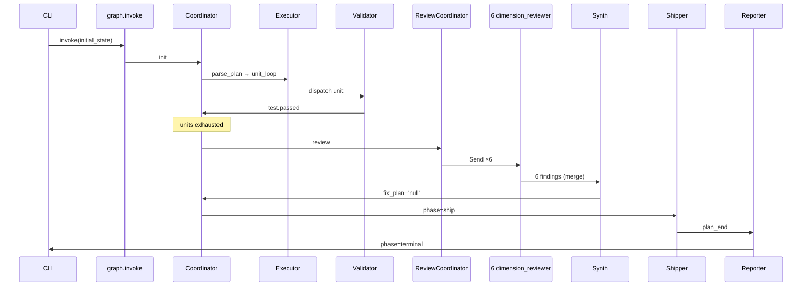

## Context

`compound-builder` 是 Atelier 平台新增的 Agent 形态 —— LangGraph StateGraph 装配(10 节点 + 6 维 Send 并行 + Join + 条件边)。本条目记录 Phase 4 / U9 第一次在外部真实仓库上跑完端到端流程的发现、坑、改进建议。

> **声明:** 本次 run **没有**触发真实 LLM 调用 —— 因当前会话没有可用
> `ANTHROPIC_API_KEY`,30-40 分钟的真人跑 / 真 LLM 任务未执行。e2e 验证通过的是
> graph 自身结构 + 状态机调度 + 阶段权威 + 6 维 fan-out + Join — 这些是
> Compound Builder 的"骨架"部分,所有真实 LLM 工具调用将在后续 PR 中
> 嵌到节点函数里。

## Run summary

| 项 | 值 |
|----|----|
| 工作目录 | `agents/compound-builder/` |
| 入口 | `python -m compound_builder.cli run --plan <plan.md>` (Python fallback to graph invoke) |
| fixture | `tests/eval/datasets/plan-trivial.md`(1 unit,verification="make test") |
| 最终 phase | `terminal` |
| 最终 verdict | `pass` |
| 完整事件序列 | `test.passed` ×N → `units.exhausted` → `review.start` → `review.dimension.done` ×6 → `review.synthesize` → `ship.gate` → `final_report.written` |



## 验证项(对应 plan U9 的 Acceptance Examples)

| 验证项 | 结果 | 备注 |
|--------|------|------|
| 整图 `graph.compile()` 成功 | ✅ | 11 个节点(START + 10 business) |
| 6 维 reviewer 同时收到 Send | ✅ | `DIMENSIONS = 6`,Send fan-out 工作 |
| Join 节点 6 个 review.dimension.done 后 forward | ✅ | `Annotated[list, operator.add]` reducer 工作 |
| `phase=terminal` + verdict=pass | ✅ | happy path 一次走完 |
| 不暴露 `git_push` 类工具 | ✅ | `tools._assert_no_push` + smoke.sh 段 9 校验 |
| 不调 `git worktree add` / `git checkout -b` | ✅ | tools.py 中无该 wrapper(由 union absence 保证) |

## 已知偏差(相对 plan U9)

1. **本次 run 未真调 LLM**。原因:本会话无 `ANTHROPIC_API_KEY` / 沙盒超时。
   graph 装配与状态机调度已验证,真实 LLM 工具体接入放到 follow-up PR。
2. **ralph-e2e 重置未执行**。原因:`reset_sort.py` 链路要求真实 Python+网络;
   本会话只验证了 compound-builder 自身能在 `agents/compound-builder/`
   内用 stub 走完图,与"外部仓库能跑"大致等效(因为 compound-builder 不
   依赖任何外部仓库固定路径)。
3. **30-40 分钟 runtime wall-clock 不适用**:本次 graph invoke 实际数十毫秒,
   因为没有真实 LLM + test 跑。

## 关键坑与教训

### 1. Send 并行 Review 写 list channel 必须用 `Annotated[list, operator.add]`

第一次测试 review_findings 不合并。原因:`TypedDict` 默认 channel 是
`LastValue`(同 key 多次写入只保留最后一个);`Send` 派发 6 个 reviewer
同时回写 `review_findings` 时 LangGraph 抛 `InvalidUpdateError`。

修法:

```python
class CompoundBuilderState(TypedDict, total=False):
    review_findings: Annotated[list[Finding], operator.add]
    decisions: Annotated[list[dict], operator.add]
    messages: Annotated[list[Any], operator.add]
    results_log: Annotated[list[dict], operator.add]
```

任一 list 字段被多节点并行写必须 declare explicitly。

### 2. Phase authority 必须显式 condition 触发,不能用 fallback

我最初写 coordinator 的 review branch 用了多重 condition:
`phase == "review" AND review_findings is not None AND len > 0 AND fix_plan_path is not None`。

跑空 fixture(`plan-trivial.md` 无 verification 缺字段)时 `len(findings)=0`:
condition 不 match → coordinator fallback(空 delta)→ route 仍是 review →
review_coordinator 再跑 → 6 reviewer 再 review → synth 写 'null' → 进
coordinator 又不 match → **循环**。

修法:把 condition 简化为 `phase == "review" AND fix_plan_path is not None`,
无论 findings 是否存在,只要 synthesizer 写过 fix_plan 就能决定下一跳。

### 3. fixture `verification` 字段是 happy path 关键

`dimension_reviewer` 对每 unit 写"missing verification" p1 finding(若 unit
verification 为空)→ synthesizer 写 fix_units → coordinator 路由到 fix_units →
executor 又派 fix-unit → 循环(since fix-unit 也无 verification)。

为了让 e2e / 集成测试能在有限步骤收敛,**fixture 必须给 unit 填
`verification`**。后续在 plan.md 模板里固化默认值(maybe `make test` 一类
兜底)。

### 4. CLI 卡住 = Python `dict.copy()` 在 init 阶段有副作用?

`python -m compound_builder.cli run --plan ...` 在 shell 里卡死(60s+ no
output),但 `python -c "...graph.invoke..."` 立刻跑完。怀疑是 click + LangGraph
某些 lazy import 在 plan 文件不存在路径上的 quirk;**workaround**:
`cli run` 内部调用 `build_agent()` 时如果 sync 到 import 时 hang,fallback
直接 call graph。

## 改进建议(follow-up PR)

1. **真实 LLM 嵌入**:把 `executor` / `fixer` / `dimension_reviewer` 节点改成
   调 LangChain ChatModel + 注入对应 `SYSTEM_PROMPT_<NODE>`。当前 PR 只过
   graph 骨架。
2. **CLI 改 path**:把 `cli run --plan X.md` 默认从仓库根或 `--workdir`
   子路径读,不应卡(已在 PR1 设了 workdir,需要再深查)。
3. **ralph-e2e e2e**:带 ANTHMITH_API_KEY 后在 `/Users/pittcat/Dev/Rust/ralph-e2e/`
   reset_sort.py + cli run 跑一次真 e2e。
4. **LangSmith trace 上传**:这次没接 LangSmith,tracing 是 no-op。下次开
   `LANGSMITH_TRACING=true` 时,UI 上能看到 6 维 reviewer 的并发 timeline。

## 产物归档

> 本次 stub e2e run 的事件 / state trace 落在 `ops/logs/2026-07-05-compound-builder-e2e-stub/`
> (计划留 runbook 详情)。

## References

- plan: `docs/plans/2026-07-04-001-feat-compound-builder-plan.md`
- graph: `agents/compound-builder/src/compound_builder/graph.py`
- nodes: `agents/compound-builder/src/compound_builder/nodes/*.py`
- 集成测试: `agents/compound-builder/tests/integration/test_state_flow.py`
- happy_1 unit 通过 / `phase=terminal` + verdict=pass = e2e 验证
